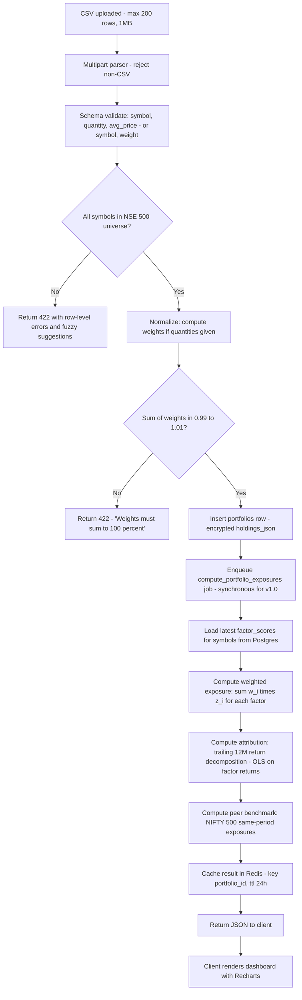
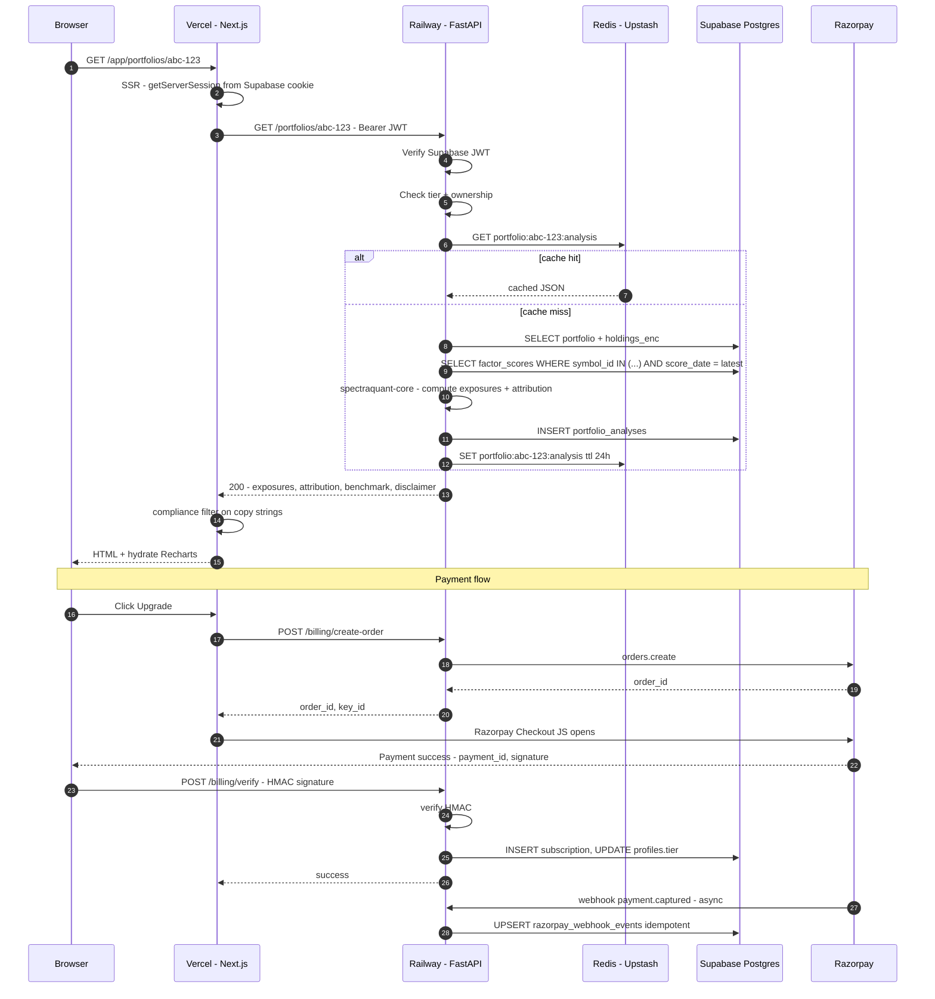
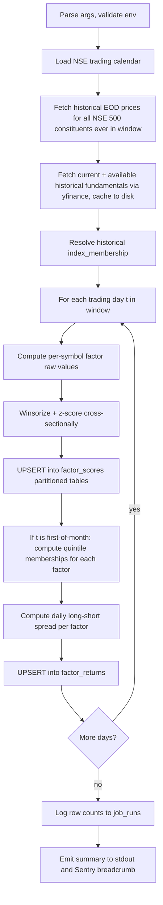

# SpectraQuant Retail — Product Spec & System Design

**Version:** 1.0 (draft)
**Owner:** Sid (solo founder)
**Status:** Pre-build, locked scope for v1.0 (week-1 launch)
**Audience:** Engineering self-review, future contractors, future investors

---

## 0. Document Conventions

- **MUST / SHOULD / MAY** follow RFC 2119 semantics.
- **v1.0** = week-1 launch. **v1.1** = weeks 2–4. **v1.2** = month 2 (mobile + API).
- All currency in INR unless prefixed.
- "Copy" = user-facing text. All copy in this doc is the canonical reference; deviations require a compliance review.
- Rejected alternatives are called out explicitly under **Tradeoff** blocks.

---

## 1. Positioning Statement

**Tagline:** *Factor analytics for the Indian retail investor.*

**Positioning (3 sentences, 47 words):**
SpectraQuant Retail decomposes any Indian equity portfolio into its five core factor exposures — momentum, value, quality, low-volatility, and size — and attributes returns to each. Tickertape tells you what a stock is; Screener tells you what a company earns. SpectraQuant tells you *why* your portfolio behaves the way it does.

**Tradeoff:** Rejected "AI-powered" framing. Adds noise, invites SEBI scrutiny, and dilutes the factor narrative. Rejected "smart beta for retail" because most retail users don't know the term and won't search for it.

---

## 2. User Personas

### Primary — "Rohan, the Substack Quant"
- **Age / location:** 29, Bengaluru. Software engineer, ₹35L CTC.
- **Portfolio:** ₹12L direct equity, 18 stocks, no MFs. Manages on Zerodha.
- **Experience:** 4 years investing. Reads Capitalmind, Marcellus letters, Aswath Damodaran. Knows what beta is, has heard of factor investing.
- **Tools today:** Tickertape Pro (₹2,399/yr), Screener.in (free), Google Sheets for P&L.
- **Pain:** Cannot tell whether his outperformance is skill or just a momentum tilt. No tool in India answers this.
- **WTP:** ₹1,699/yr Pro. Will upgrade to Elite for alerts.

### Secondary — "Anita, the Serious DIY Investor"
- **Age / location:** 41, Mumbai. Mid-career marketing director, ₹60L CTC.
- **Portfolio:** ₹45L across 32 stocks + 4 MFs. Two demat accounts (self + spouse).
- **Experience:** 10+ years, fundamentals-led. Trusts Saurabh Mukherjea, distrusts F&O.
- **Tools today:** Screener.in Pro (₹4,999/yr), Trendlyne, broker research PDFs.
- **Pain:** Can't see whether her "quality and low-vol" thesis is actually expressed in her portfolio. Suspects style drift.
- **WTP:** ₹4,499/yr Elite for multi-portfolio + custom composite.

### Tertiary — "Karthik, the SIP-graduate Curious Learner"
- **Age / location:** 26, Hyderabad. Junior dev, ₹14L CTC.
- **Portfolio:** ₹2.5L, 6 stocks + ₹15k/mo SIP. New to direct equity.
- **Experience:** 18 months. Reads Twitter finance, Zerodha Varsity, Groww blog.
- **Tools today:** Groww app, free Tickertape, YouTube.
- **Pain:** Doesn't know if his "small-cap momentum" picks are coherent or just Twitter noise.
- **WTP:** Free → ₹199/mo Pro after one "aha" moment. Annual conversion is unlikely in year 1.

**Tradeoff:** No persona for the F&O trader, the institutional analyst, or the financial advisor. F&O needs intraday data we won't license. Institutional has Bloomberg/FactSet. Advisors trigger SEBI RIA/RA scope creep.

---

## 3. Information Architecture

### 3.1 Sitemap

```
/                                    Public · Marketing landing
/pricing                             Public · Pricing page
/blog/[slug]                         Public · SEO content (factor explainers)
/methodology                         Public · Factor formulas, data sources, disclaimers
/legal/terms                         Public · ToS
/legal/privacy                       Public · Privacy policy (DPDP-compliant)
/legal/disclaimer                    Public · Full risk + non-advisory disclaimer
/legal/refund                        Public · Razorpay-mandated refund policy

/auth/login                          Public · Magic link + Google OAuth
/auth/callback                       Public · OAuth callback
/auth/logout                         Public · POST only

/app                                 Auth · Dashboard (default landing post-login)
/app/portfolios                      Auth · Portfolio list (Pro+: many; Free: 1 ephemeral)
/app/portfolios/new                  Auth · Upload CSV / paste holdings
/app/portfolios/[id]                 Auth · Portfolio detail — factor breakdown
/app/portfolios/[id]/attribution     Auth · Return attribution by factor
/app/portfolios/[id]/exposures       Auth · Factor tilts vs NIFTY 500
/app/portfolios/[id]/holdings        Auth · Stock-level factor scores
/app/portfolios/[id]/export          Paywall (Pro+) · CSV/PDF export

/app/screener                        Auth · Factor screener (Free: top 20; Pro: 500)
/app/screener/saved                  Paywall (Pro+) · Saved screens
/app/stocks/[symbol]                 Auth · Single-stock factor card
/app/composites                      Paywall (Elite) · Custom factor composites
/app/alerts                          Paywall (Elite) · Factor-tilt alerts (email + in-app)
/app/api-keys                        Paywall (Elite) · API key management

/app/account                         Auth · Profile + email
/app/billing                         Auth · Subscription, invoices, payment method
/app/billing/upgrade                 Auth · Plan selector → Razorpay checkout
/app/settings                        Auth · Notifications, data deletion

/api/v1/*                            Paywall (Elite) · REST API (rate-limited per tier)
/api/internal/*                      Internal · Webhooks (Razorpay, Supabase)

/admin                               Admin-only · Founder console (metrics, user list)
/admin/jobs                          Admin-only · Background job status
/admin/compliance-log                Admin-only · Forbidden-word filter hits
```

### 3.2 Gating Matrix

| Route prefix          | Anonymous | Free auth | Pro          | Elite        |
|-----------------------|-----------|-----------|--------------|--------------|
| `/`, `/pricing`, `/blog`, `/methodology`, `/legal/*` | ✅ | ✅ | ✅ | ✅ |
| `/auth/*`             | ✅        | ✅        | ✅           | ✅           |
| `/app` (dashboard)    | ❌        | ✅ (limited) | ✅        | ✅           |
| `/app/portfolios/new` | ❌        | ✅ (1/mo, ephemeral) | ✅ unlimited | ✅ unlimited |
| `/app/portfolios/[id]` | ❌       | ✅ if owned | ✅          | ✅           |
| `/app/portfolios/[id]/export` | ❌ | 🔒 paywall | ✅      | ✅           |
| `/app/screener`       | ❌        | ✅ (top 20) | ✅ (full 500) | ✅ (full 500) |
| `/app/screener/saved` | ❌        | 🔒 paywall | ✅          | ✅           |
| `/app/composites`     | ❌        | 🔒 paywall | 🔒 paywall  | ✅           |
| `/app/alerts`         | ❌        | 🔒 paywall | 🔒 paywall  | ✅           |
| `/app/api-keys`       | ❌        | 🔒 paywall | 🔒 paywall  | ✅           |
| `/api/v1/*`           | ❌        | ❌        | ❌           | ✅ (rate-limited) |

### 3.3 Compliance Disclaimer Placement

| Surface | Disclaimer |
|---------|------------|
| Footer (every page) | Short pill: "Analytics, not advice. SpectraQuant Retail is not a SEBI-registered advisor." links to `/legal/disclaimer`. |
| `/app/portfolios/[id]` (top sticky banner, dismissible per session) | "Factor scores are descriptive analytics computed from public EOD data. Not investment advice." |
| Every PDF/CSV export (header + footer) | Full disclaimer block (see §11). |
| First-time portfolio upload modal | One-time hard acknowledgement checkbox: "I understand SpectraQuant provides analytics, not investment advice." |
| Email digests (Elite alerts) | Footer block + unsubscribe. |
| `/api/v1/*` JSON responses | `_disclaimer` field on every payload. |

---

## 4. Key User Flows

### 4.1 New User: Landing → Signup → First Portfolio → Paywall Hit

```mermaid
flowchart TD
    A[Land on /] --> B{Click 'Try free'?}
    B -- No --> A1[Read /pricing or /methodology] --> B
    B -- Yes --> C[/auth/login - magic link or Google/]
    C --> D[Email verified / OAuth callback]
    D --> E[/app dashboard - empty state/]
    E --> F[Click 'Upload portfolio']
    F --> G[/app/portfolios/new]
    G --> H[Paste 18 tickers + weights OR upload Zerodha CSV]
    H --> I{Compliance ack checkbox?}
    I -- No --> H
    I -- Yes --> J[POST /api/portfolios - validate]
    J --> K{Valid?}
    K -- No --> H1[Show row-level errors]
    H1 --> H
    K -- Yes --> L[Compute factor exposures - 3 to 5s]
    L --> M[Render /app/portfolios/:id - exposures + attribution]
    M --> N{User clicks 'Export PDF'?}
    N -- Yes --> O[Paywall modal - Pro 199/mo or 1699/yr]
    O --> P[/app/billing/upgrade]
    N -- No --> Q[User explores screener]
    Q --> R{User clicks rank 21+ in screener?}
    R -- Yes --> O
```

**Activation event:** "first portfolio analyzed" fires on successful render of `/app/portfolios/[id]`.

### 4.2 Returning User: Login → Dashboard → Screener → Export

```mermaid
flowchart TD
    A[/auth/login/] --> B[Magic link click]
    B --> C[/app dashboard]
    C --> D[See last portfolio exposures + 'what changed' delta since last login]
    D --> E[Click /app/screener]
    E --> F[Filter: momentum >= 0.7 AND quality >= 0.5]
    F --> G[Server returns ranked list - cached]
    G --> H{Plan?}
    H -- Free --> I[Show top 20, paywall row 21+]
    H -- Pro/Elite --> J[Show all 500]
    J --> K[Click 'Export CSV']
    K --> L[POST /api/screener/export - signed URL]
    L --> M[Browser downloads .csv with disclaimer header]
```

### 4.3 Payment: Free → Paywall → Razorpay → Webhook → Upgraded

```mermaid
flowchart TD
    A[Free user hits paywall] --> B[/app/billing/upgrade?plan=pro_yearly&from=export]
    B --> C[POST /api/billing/create-order]
    C --> D[Server creates Razorpay order - amount=169900 paise, currency=INR]
    D --> E[Razorpay Checkout JS opens - prefilled email]
    E --> F{Payment success?}
    F -- No --> G[Show retry / error]
    F -- Yes --> H[Razorpay returns payment_id + signature]
    H --> I[POST /api/billing/verify - HMAC verify signature]
    I --> J{Signature valid?}
    J -- No --> K[Mark suspicious, alert admin]
    J -- Yes --> L[Insert subscription row, set tier=pro, period_end=now+1y]
    L --> M[Redirect /app/billing?status=success]
    
    N[Razorpay webhook POST /api/internal/razorpay/webhook] --> O[Verify webhook signature]
    O --> P{Event type}
    P -- payment.captured --> Q[Idempotent upsert subscription]
    P -- subscription.cancelled --> R[Set tier_downgrade_at = period_end]
    P -- payment.failed --> S[Email user, no tier change]
```

**Idempotency key:** `razorpay_payment_id` on the `subscriptions` table — UNIQUE constraint so duplicate webhook delivery is a no-op.

### 4.4 Analysis Pipeline: CSV Upload → Validation → Compute → Render



**Performance budget:** Steps J→P MUST complete in < 5s p95 for a 50-stock portfolio. Factor scores are pre-computed nightly so the only runtime work is a weighted sum + an OLS over ~252 daily returns × 5 factors.

---

---

## 5. MVP Feature Cut

**Cutting principle:** v1.0 must be implementable by one developer in 7 days. Anything that requires a third-party integration beyond Razorpay + Supabase + Resend gets deferred. Anything that requires bespoke ML training gets deferred. Anything that has a 50% chance of taking 2 days when estimated at 4 hours gets deferred.

| # | Feature | v1.0 | v1.1 (wks 2–4) | v1.2 (mo 2) | Notes |
|---|---------|------|----------------|-------------|-------|
| 1 | Marketing landing + pricing + methodology pages | ✅ | | | Static MDX. No A/B test. |
| 2 | Magic-link auth (Resend) | ✅ | | | Supabase Auth handles. |
| 3 | Google OAuth | | ✅ | | Defer — magic link covers 90% of signups. |
| 4 | Portfolio CSV upload (Zerodha + generic format) | ✅ | | | Two parsers. Reject everything else with explicit error. |
| 5 | Manual portfolio paste (symbol, weight) | ✅ | | | Textarea + table preview. |
| 6 | Broker integration (Zerodha Kite, Upstox) | | | ✅ | OAuth, costs founder time + dev API costs. |
| 7 | Factor exposures view (5 factors + composite) | ✅ | | | Bar chart vs NIFTY 500 benchmark. |
| 8 | Return attribution (12M, OLS decomposition) | ✅ | | | Single chart, one timeframe. |
| 9 | Stock-level factor scores in holdings table | ✅ | | | Sortable. |
| 10 | Factor screener (Free top 20 / Pro full 500) | ✅ | | | Server-side filter + sort. |
| 11 | Saved screens | | ✅ | | Pro+. |
| 12 | Single-stock factor card `/app/stocks/[symbol]` | ✅ | | | Read-only, no charts beyond a sparkline. |
| 13 | Historical factor performance charts | | ✅ | | Recharts line, 5y. |
| 14 | Custom composite factor builder | | | ✅ | Elite. Drag-weight UI is a 3-day job. |
| 15 | Factor-tilt alerts (email + in-app) | | | ✅ | Elite. Needs cron + idempotent dispatch. |
| 16 | CSV export of portfolio analysis | ✅ | | | Pro+. |
| 17 | PDF export of portfolio analysis | | ✅ | | Pro+. WeasyPrint, deferred — 1 day to do well. |
| 18 | REST API (`/api/v1/*`) | | | ✅ | Elite. |
| 19 | Razorpay one-time payment for annual plan | ✅ | | | Webhook + verify. Annual only in v1.0. |
| 20 | Razorpay subscription (monthly recurring) | | ✅ | | Use Razorpay Subscriptions API; needs more webhook plumbing. |
| 21 | Billing portal (cancel, view invoices) | ✅ | | | Minimal: cancel button + invoice list. |
| 22 | Account deletion (DPDP-compliant) | ✅ | | | Hard delete + soft anonymize log row. |
| 23 | Admin console `/admin` | ✅ | | | Read-only metrics + user list. Single founder email check. |
| 24 | Background job: nightly factor compute | ✅ | | | GitHub Actions cron, calls API endpoint. |
| 25 | Background job: subscription reconciliation | | ✅ | | Daily check vs Razorpay state. |
| 26 | Sentry error monitoring | ✅ | | | Free tier. |
| 27 | PostHog product analytics | ✅ | | | Free tier (1M events/mo). |
| 28 | SEO blog (3 launch posts) | ✅ | | | MDX in repo. "What is factor investing", "Momentum in Indian equities", "Reading your factor card". |
| 29 | Mobile responsive web | ✅ | | | Tailwind breakpoints. Not a separate codebase. |
| 30 | React Native app | | | ✅ | Reuses `/api/v1/*`. |
| 31 | Two-factor auth | | ✅ | | TOTP, low priority for v1.0. |
| 32 | Multi-portfolio (Pro = 5, Elite = unlimited) | ✅ | | | DB supports it; UI supports it. |
| 33 | Compliance forbidden-word filter | ✅ | | | Pre-render middleware on copy strings. |
| 34 | Refund flow (manual) | ✅ | | | Email-based for v1.0. Razorpay refund API in v1.1. |

**v1.0 line count target:** ~6k LoC across web + api (excluding `spectraquant-core`). If estimate exceeds 8k, cut something.

**Tradeoff:** Rejected broker integration in v1.0 despite massive UX value. Zerodha Kite Connect costs ₹2k/mo and ~2 days to integrate properly with token refresh; not worth it for week 1. CSV is the bridge.

---

## 6. Data Architecture

### 6.1 Source of Truth

| Data | Source | License | Cadence | Storage |
|------|--------|---------|---------|---------|
| EOD OHLCV (NSE 500) | NSE Bhavcopy (`https://www.nseindia.com/...`) | Free, public, redistributable for analytics | Daily 7pm IST | Postgres `eod_prices` |
| Corporate actions (splits, bonus) | NSE Equity announcements + Bhavcopy adjusted | Free | Daily | Postgres `corporate_actions` |
| Fundamentals (PE, PB, ROE, D/E, EPS) | Screener.in scraping is **not allowed** under their ToS. Use **NSE quarterly results** + **MCA filings** parsed quarterly. v1.0 fallback: yfinance proxy with caching. | Mixed — yfinance is unsupported but tolerated for low-volume | Quarterly | Postgres `fundamentals` |
| NIFTY 500 constituents | NSE indices CSV | Free | Monthly + on rebalance | Postgres `index_membership` |
| Risk-free rate | RBI 91-day T-bill | Free | Weekly | Postgres `risk_free_rate` |

**Tradeoff:** Rejected paid data (Refinitiv, Bloomberg) — out of budget. Rejected scraping Tickertape/Screener — ToS violation, brittle, legal risk. yfinance is an acknowledged short-term wart for fundamentals; replace with direct NSE filings parsing in v1.1.

### 6.2 Schema (Postgres / Supabase)

All tables use `id BIGINT GENERATED ALWAYS AS IDENTITY PRIMARY KEY` unless noted. All timestamps are `TIMESTAMPTZ` defaulting to `now()`. All `created_at` / `updated_at` columns are managed by triggers.

#### Universe & market data

```sql
-- Symbol master
CREATE TABLE symbols (
  id              BIGINT GENERATED ALWAYS AS IDENTITY PRIMARY KEY,
  nse_symbol      TEXT NOT NULL UNIQUE,           -- e.g. 'RELIANCE'
  isin            TEXT NOT NULL UNIQUE,           -- e.g. 'INE002A01018'
  company_name    TEXT NOT NULL,
  sector          TEXT,
  industry        TEXT,
  is_active       BOOLEAN NOT NULL DEFAULT TRUE,  -- false on delisting
  listed_on       DATE,
  created_at      TIMESTAMPTZ NOT NULL DEFAULT now(),
  updated_at      TIMESTAMPTZ NOT NULL DEFAULT now()
);
-- Justification: stable surrogate key, ISIN as the cross-source join key.

-- End-of-day prices (partitioned by year for fast scan)
CREATE TABLE eod_prices (
  symbol_id       BIGINT NOT NULL REFERENCES symbols(id),
  trade_date      DATE NOT NULL,
  open            NUMERIC(14,4) NOT NULL,
  high            NUMERIC(14,4) NOT NULL,
  low             NUMERIC(14,4) NOT NULL,
  close           NUMERIC(14,4) NOT NULL,
  adj_close       NUMERIC(14,4) NOT NULL,         -- adjusted for splits + bonus
  volume          BIGINT NOT NULL,
  PRIMARY KEY (symbol_id, trade_date)
) PARTITION BY RANGE (trade_date);
CREATE INDEX eod_prices_date_idx ON eod_prices (trade_date);
-- Justification: PK ordering supports per-symbol time-series scans;
-- partition prunes old years on backtest queries.

-- Index constituents (e.g. NIFTY 500 membership history)
CREATE TABLE index_membership (
  id              BIGINT GENERATED ALWAYS AS IDENTITY PRIMARY KEY,
  index_name      TEXT NOT NULL,                  -- 'NIFTY500', 'NIFTY50', etc.
  symbol_id       BIGINT NOT NULL REFERENCES symbols(id),
  effective_from  DATE NOT NULL,
  effective_to    DATE,                            -- NULL means current
  weight          NUMERIC(8,6),                    -- index weight if applicable
  UNIQUE (index_name, symbol_id, effective_from)
);
CREATE INDEX idx_membership_active ON index_membership (index_name, effective_to);
-- Justification: avoids survivorship bias in backtests by tracking historical membership.

-- Corporate actions (used to back-adjust prices)
CREATE TABLE corporate_actions (
  id              BIGINT GENERATED ALWAYS AS IDENTITY PRIMARY KEY,
  symbol_id       BIGINT NOT NULL REFERENCES symbols(id),
  ex_date         DATE NOT NULL,
  action_type     TEXT NOT NULL CHECK (action_type IN ('split','bonus','dividend','rights')),
  ratio_or_amount NUMERIC(14,6) NOT NULL,         -- split=2 means 1:2
  raw_payload     JSONB,
  UNIQUE (symbol_id, ex_date, action_type)
);

-- Fundamentals snapshot (one row per symbol per quarter)
CREATE TABLE fundamentals (
  symbol_id       BIGINT NOT NULL REFERENCES symbols(id),
  period_end      DATE NOT NULL,                  -- quarter end
  market_cap      NUMERIC(18,2),                  -- INR
  pe_ratio        NUMERIC(10,4),
  pb_ratio        NUMERIC(10,4),
  ev_ebitda       NUMERIC(10,4),
  roe             NUMERIC(10,6),
  roce            NUMERIC(10,6),
  debt_to_equity  NUMERIC(10,4),
  eps_ttm         NUMERIC(14,4),
  source          TEXT NOT NULL,                  -- 'yfinance', 'nse_filings'
  fetched_at      TIMESTAMPTZ NOT NULL DEFAULT now(),
  PRIMARY KEY (symbol_id, period_end)
);

CREATE TABLE risk_free_rate (
  rate_date       DATE PRIMARY KEY,
  rate_pct        NUMERIC(8,4) NOT NULL           -- annualized %
);
```

#### Factor scores

```sql
-- Daily factor z-scores per symbol (this is the hot table)
CREATE TABLE factor_scores (
  symbol_id       BIGINT NOT NULL REFERENCES symbols(id),
  score_date      DATE NOT NULL,
  factor          TEXT NOT NULL CHECK (factor IN ('momentum','value','quality','low_vol','size','composite')),
  raw_value       NUMERIC(18,8),                  -- pre-normalization
  z_score         NUMERIC(10,6) NOT NULL,         -- winsorized + cross-sectionally standardized
  rank_pct        NUMERIC(6,4) NOT NULL,          -- 0..1 across NIFTY 500 universe
  PRIMARY KEY (symbol_id, score_date, factor)
) PARTITION BY RANGE (score_date);
CREATE INDEX factor_scores_lookup ON factor_scores (score_date, factor, z_score DESC);
-- Justification: lookups are 'top N stocks by factor X on date D' — covered by index.
-- Partition by date keeps active partition small (5 factors × 500 symbols = 2500 rows/day).

-- Daily factor returns (for attribution OLS)
CREATE TABLE factor_returns (
  factor          TEXT NOT NULL,
  return_date     DATE NOT NULL,
  daily_return    NUMERIC(14,8) NOT NULL,         -- long-short or long-only spec
  PRIMARY KEY (factor, return_date)
);
-- Justification: OLS regression of portfolio returns on these series.
```

#### User & subscription

```sql
-- Supabase Auth manages auth.users — we mirror minimal columns we need
CREATE TABLE profiles (
  id              UUID PRIMARY KEY REFERENCES auth.users(id) ON DELETE CASCADE,
  email           TEXT NOT NULL UNIQUE,
  display_name    TEXT,
  tier            TEXT NOT NULL DEFAULT 'free' CHECK (tier IN ('free','pro','elite')),
  tier_renews_at  TIMESTAMPTZ,
  created_at      TIMESTAMPTZ NOT NULL DEFAULT now(),
  marketing_opt_in BOOLEAN NOT NULL DEFAULT FALSE
);

CREATE TABLE subscriptions (
  id                       BIGINT GENERATED ALWAYS AS IDENTITY PRIMARY KEY,
  user_id                  UUID NOT NULL REFERENCES profiles(id) ON DELETE CASCADE,
  plan                     TEXT NOT NULL CHECK (plan IN ('pro_monthly','pro_yearly','elite_monthly','elite_yearly')),
  status                   TEXT NOT NULL CHECK (status IN ('active','past_due','cancelled','expired')),
  razorpay_payment_id      TEXT UNIQUE,           -- idempotency key
  razorpay_subscription_id TEXT UNIQUE,           -- null for one-time annual
  amount_paise             BIGINT NOT NULL,
  period_start             TIMESTAMPTZ NOT NULL,
  period_end               TIMESTAMPTZ NOT NULL,
  cancelled_at             TIMESTAMPTZ,
  created_at               TIMESTAMPTZ NOT NULL DEFAULT now()
);
CREATE INDEX subscriptions_user_active ON subscriptions (user_id) WHERE status = 'active';

CREATE TABLE razorpay_webhook_events (
  id              BIGINT GENERATED ALWAYS AS IDENTITY PRIMARY KEY,
  event_id        TEXT NOT NULL UNIQUE,           -- Razorpay webhook x-razorpay-event-id
  event_type      TEXT NOT NULL,
  payload         JSONB NOT NULL,
  processed_at    TIMESTAMPTZ,
  error           TEXT,
  received_at     TIMESTAMPTZ NOT NULL DEFAULT now()
);
-- Justification: idempotent webhook processing requires storing event_id.
```

#### Portfolios & analyses

```sql
CREATE TABLE portfolios (
  id              UUID PRIMARY KEY DEFAULT gen_random_uuid(),
  user_id         UUID NOT NULL REFERENCES profiles(id) ON DELETE CASCADE,
  name            TEXT NOT NULL,
  -- Holdings encrypted with pgcrypto AES; key in Supabase Vault
  holdings_enc    BYTEA NOT NULL,                 -- {symbol, qty, avg_price, weight}[]
  num_holdings    INT NOT NULL,
  total_value_inr NUMERIC(18,2),                  -- nullable if user gave only weights
  created_at      TIMESTAMPTZ NOT NULL DEFAULT now(),
  updated_at      TIMESTAMPTZ NOT NULL DEFAULT now(),
  deleted_at      TIMESTAMPTZ                     -- soft delete for 30d grace
);
CREATE INDEX portfolios_user ON portfolios (user_id) WHERE deleted_at IS NULL;
-- Justification: holdings are PII — encrypt at rest with column-level encryption,
-- not just disk encryption. Soft delete enables DPDP undo window.

CREATE TABLE portfolio_analyses (
  id                    UUID PRIMARY KEY DEFAULT gen_random_uuid(),
  portfolio_id          UUID NOT NULL REFERENCES portfolios(id) ON DELETE CASCADE,
  analysis_date         DATE NOT NULL,            -- factor_scores date used
  exposures_json        JSONB NOT NULL,           -- {momentum: 0.42, value: -0.18, ...}
  attribution_json      JSONB NOT NULL,           -- {factor: contribution_bps}
  benchmark             TEXT NOT NULL DEFAULT 'NIFTY500',
  benchmark_exposures   JSONB NOT NULL,
  computed_at           TIMESTAMPTZ NOT NULL DEFAULT now(),
  ttl_until             TIMESTAMPTZ NOT NULL DEFAULT (now() + interval '24 hours')
);
CREATE INDEX portfolio_analyses_lookup ON portfolio_analyses (portfolio_id, analysis_date DESC);
-- Justification: server-side cache of computed results, avoids recompute on refresh.

CREATE TABLE saved_screens (
  id              UUID PRIMARY KEY DEFAULT gen_random_uuid(),
  user_id         UUID NOT NULL REFERENCES profiles(id) ON DELETE CASCADE,
  name            TEXT NOT NULL,
  filter_json     JSONB NOT NULL,                 -- {momentum: {gte: 0.7}, quality: {gte: 0.5}}
  created_at      TIMESTAMPTZ NOT NULL DEFAULT now()
);

CREATE TABLE alerts (
  id              UUID PRIMARY KEY DEFAULT gen_random_uuid(),
  user_id         UUID NOT NULL REFERENCES profiles(id) ON DELETE CASCADE,
  portfolio_id    UUID REFERENCES portfolios(id) ON DELETE CASCADE,
  alert_type      TEXT NOT NULL CHECK (alert_type IN ('exposure_drift','factor_rank_change','composite_threshold')),
  config_json     JSONB NOT NULL,
  is_active       BOOLEAN NOT NULL DEFAULT TRUE,
  last_fired_at   TIMESTAMPTZ,
  created_at      TIMESTAMPTZ NOT NULL DEFAULT now()
);
```

#### Operational

```sql
CREATE TABLE api_keys (
  id              UUID PRIMARY KEY DEFAULT gen_random_uuid(),
  user_id         UUID NOT NULL REFERENCES profiles(id) ON DELETE CASCADE,
  prefix          TEXT NOT NULL,                  -- 'sq_live_xxxxxxxx' first 11 chars
  hashed_key      TEXT NOT NULL,                  -- bcrypt of full key
  name            TEXT NOT NULL,
  last_used_at    TIMESTAMPTZ,
  revoked_at      TIMESTAMPTZ,
  created_at      TIMESTAMPTZ NOT NULL DEFAULT now()
);
CREATE INDEX api_keys_prefix ON api_keys (prefix) WHERE revoked_at IS NULL;

CREATE TABLE rate_limit_buckets (
  bucket_key      TEXT PRIMARY KEY,               -- 'user:{uuid}:hour:{epoch_hour}'
  count           INT NOT NULL DEFAULT 0,
  window_start    TIMESTAMPTZ NOT NULL DEFAULT now()
);
-- v1.0 may use Redis instead — Postgres is fallback only.

CREATE TABLE compliance_log (
  id              BIGINT GENERATED ALWAYS AS IDENTITY PRIMARY KEY,
  context         TEXT NOT NULL,                  -- route or template name
  matched_term    TEXT NOT NULL,
  raw_text        TEXT NOT NULL,
  created_at      TIMESTAMPTZ NOT NULL DEFAULT now()
);
-- Justification: audit trail for SEBI inquiries; also informs filter tuning.

CREATE TABLE job_runs (
  id              BIGINT GENERATED ALWAYS AS IDENTITY PRIMARY KEY,
  job_name        TEXT NOT NULL,
  status          TEXT NOT NULL CHECK (status IN ('running','succeeded','failed')),
  started_at      TIMESTAMPTZ NOT NULL DEFAULT now(),
  finished_at     TIMESTAMPTZ,
  error           TEXT,
  metrics_json    JSONB
);
```

### 6.3 Encryption Strategy

- Holdings JSON encrypted with **pgcrypto `pgp_sym_encrypt`** using a key from Supabase Vault.
- Encryption is column-level, not just disk-level — protects against compromised DB read access.
- API keys stored as bcrypt hashes; the raw key is shown to user once and never persisted.
- Portfolio analyses (`exposures_json`, `attribution_json`) are aggregate stats, not PII — left unencrypted to keep the screener fast.

**Tradeoff:** Rejected per-user encryption keys. Adds key-rotation complexity that isn't justified at < 10k users.

---

## 7. Factor Model Spec

**Universe:** NSE 500 constituents as of each rebalance date. Survivorship bias avoided by joining on `index_membership` history.

**Lookback / rebalance:** Factor scores recomputed **daily** (cheap). Factor *portfolios* used for the return series rebalance **monthly** (1st trading day).

**Pipeline (every factor):**
1. Compute raw value per symbol.
2. **Winsorize** at 1st and 99th percentile cross-sectionally each day.
3. **Cross-sectional z-score** within universe: `z = (x − μ) / σ`.
4. Persist `(raw_value, z_score, rank_pct)` to `factor_scores`.
5. Composite = equal-weighted z-score across all five factors, then re-z-scored.

### 7.1 Momentum

- **Definition:** 12-month return excluding the most recent month (12-1 momentum).
- **Formula:** `M_t = (P_{t-21} / P_{t-252}) − 1` using adjusted close.
- **Why skip 1m:** standard correction for short-term reversal effect (Jegadeesh & Titman 1993).
- **Lookback:** 252 trading days.
- **Eligibility:** symbol must have ≥ 240 daily prices in the window (drops new listings).

### 7.2 Value

- **Definition:** Composite of three normalized inverse-multiples.
- **Inputs:** earnings yield (1/PE), book yield (1/PB), EBITDA yield (1/EV-EBITDA).
- **Formula:** `V_t = mean(z(1/PE), z(1/PB), z(1/EV_EBITDA))`, then re-z-scored.
- **Source:** `fundamentals` table, latest period_end ≤ score_date.
- **Treatment of negatives:** if PE or PB is negative, the corresponding component is set to the worst decile (rank_pct = 0.05) rather than dropped — captures distress signal.
- **Lookback:** quarterly fundamentals; 90-day staleness max.

### 7.3 Quality

- **Definition:** Composite of profitability, leverage, and earnings stability.
- **Inputs:**
  - **Profitability:** ROE (TTM).
  - **Leverage:** −1 × (Debt / Equity) (signed so higher is better).
  - **Earnings stability:** −1 × σ(EPS_TTM over last 8 quarters) / |mean(EPS_TTM)| (coefficient of variation, inverted).
- **Formula:** `Q_t = mean(z(ROE), z(−D/E), z(−CV_EPS))`, re-z-scored.
- **Lookback:** 8 quarters of fundamentals required.

### 7.4 Low Volatility

- **Definition:** Inverse of trailing 252-day daily-return standard deviation.
- **Formula:** `LV_t = −1 × σ(r_daily, last 252d)`, then z-scored.
- **Eligibility:** ≥ 240 daily returns in window.

### 7.5 Size

- **Definition:** Inverse of market cap (small-cap premium captured by negative correlation).
- **Formula:** `S_t = −1 × ln(market_cap_inr)`, then z-scored.
- **Source:** `fundamentals.market_cap`.

### 7.6 Composite

- **Formula:** `C_t = z( mean(z_M, z_V, z_Q, z_LV, z_S) )`.
- **Equal weights** in v1.0. v1.2 (Elite) lets users supply custom weights with sum-to-1 constraint.

### 7.7 Portfolio Exposures

For a portfolio with weights `w_i` summing to 1, exposure to factor `f` on date `t`:

```
E_f(t) = Σ_i w_i · z_{i,f,t}
```

Benchmark exposure (NIFTY 500) computed identically using index weights from `index_membership`. The displayed "tilt" is `E_f^portfolio − E_f^benchmark`.

### 7.8 Return Attribution

12-month attribution via OLS:

```
r_p(t) = α + Σ_f β_f · r_f(t) + ε_t
```

where `r_f(t)` is the daily factor return from `factor_returns` (long top quintile − short bottom quintile, equal-weighted, monthly rebalance). Reported attribution per factor = `β_f × cumulative r_f` over the window. Residual = `α + Σ ε_t`.

**Confidence intervals:** Newey-West HAC standard errors with 5-lag adjustment. Display 95% CI on each `β_f`. UI shows `n.s.` (not significant) when CI crosses zero.

### 7.9 Defensibility Notes

- Aligns with AQR / MSCI Barra retail-equivalent definitions.
- Documented in `/methodology` page with formulas, lookbacks, and sample size requirements.
- Out-of-sample validation: report rolling 24-month R² of the attribution model on every analysis page — if R² < 0.4 the factor model is a poor fit for that portfolio and we say so.

**Tradeoff:** Rejected machine-learning factors (e.g., learned via gradient boosting on returns). Not defensible to a quant reviewer, encourages overfitting, and blocks the "honest" product principle.

---

---

## 8. System Design

### 8.1 Monorepo Structure

```
spectraquant-retail/
├─ apps/
│  ├─ web/                          # Next.js 14 (App Router), Vercel
│  │  ├─ app/
│  │  │  ├─ (marketing)/            # /, /pricing, /blog, /methodology, /legal
│  │  │  ├─ (auth)/                 # /auth/login, /auth/callback
│  │  │  ├─ app/                    # /app/* — auth-gated SPA-like surface
│  │  │  └─ api/                    # Next route handlers (BFF only — proxies to api/)
│  │  ├─ components/
│  │  │  ├─ ui/                     # shadcn/ui primitives
│  │  │  ├─ charts/                 # Recharts wrappers (factor bars, attribution)
│  │  │  └─ portfolio/              # PortfolioUploader, ExposureBars, AttributionTable
│  │  ├─ lib/
│  │  │  ├─ supabase/               # client + server SSR helpers
│  │  │  ├─ compliance/             # forbidden-word filter (client + server)
│  │  │  └─ api-client.ts           # typed fetch wrapper to apps/api
│  │  ├─ public/
│  │  └─ tailwind.config.ts
│  │
│  └─ api/                          # FastAPI, Railway
│     ├─ src/
│     │  ├─ main.py                 # app factory, middleware, routers
│     │  ├─ deps.py                 # auth, db, redis, rate-limit dependencies
│     │  ├─ routers/
│     │  │  ├─ portfolios.py
│     │  │  ├─ screener.py
│     │  │  ├─ stocks.py
│     │  │  ├─ billing.py
│     │  │  ├─ webhooks_razorpay.py
│     │  │  ├─ admin.py
│     │  │  └─ public_v1.py         # /api/v1/* for Elite tier
│     │  ├─ schemas/                # pydantic models — request/response contracts
│     │  ├─ services/
│     │  │  ├─ portfolio_service.py # orchestrates core compute + cache
│     │  │  ├─ screener_service.py
│     │  │  ├─ billing_service.py   # Razorpay + DB
│     │  │  └─ compliance_service.py
│     │  ├─ jobs/
│     │  │  ├─ nightly_factor_compute.py
│     │  │  ├─ daily_eod_ingest.py
│     │  │  ├─ subscription_reconcile.py
│     │  │  └─ alerts_dispatch.py
│     │  └─ infra/
│     │     ├─ db.py                # SQLAlchemy + Supabase Postgres
│     │     ├─ redis.py
│     │     ├─ encryption.py        # pgcrypto wrapper
│     │     └─ observability.py     # Sentry, structured logs, PostHog server
│     ├─ tests/
│     ├─ pyproject.toml
│     └─ Dockerfile
│
├─ packages/
│  ├─ spectraquant-core/            # PURE library — no Streamlit, no I/O side effects
│  │  ├─ src/spectraquant_core/
│  │  │  ├─ factors/
│  │  │  │  ├─ momentum.py
│  │  │  │  ├─ value.py
│  │  │  │  ├─ quality.py
│  │  │  │  ├─ low_vol.py
│  │  │  │  ├─ size.py
│  │  │  │  └─ composite.py
│  │  │  ├─ universe.py             # NSE 500 membership filter
│  │  │  ├─ normalize.py            # winsorize + z-score
│  │  │  ├─ portfolio.py            # exposure + weight math
│  │  │  ├─ attribution.py          # OLS + Newey-West
│  │  │  ├─ data_models.py          # pydantic dataclasses for prices/fundamentals
│  │  │  └─ errors.py
│  │  ├─ tests/                     # pytest, deterministic fixtures
│  │  └─ pyproject.toml
│  │
│  ├─ shared-types/                 # TypeScript types generated from pydantic
│  │  └─ src/index.ts
│  │
│  └─ compliance-rules/             # forbidden_words.json + disclaimer_copy.md
│     └─ src/index.ts
│
├─ infra/
│  ├─ supabase/
│  │  ├─ migrations/                # SQL migrations, sequenced
│  │  └─ seed.sql
│  ├─ github-actions/
│  │  ├─ nightly-factor-compute.yml # cron 14:00 UTC = 19:30 IST
│  │  ├─ daily-eod-ingest.yml       # cron 13:30 UTC = 19:00 IST
│  │  └─ ci.yml
│  └─ vercel.json
│
├─ docs/
│  ├─ architecture.md
│  ├─ runbook.md                    # incident playbook
│  └─ methodology.md                # mirror of /methodology page content
│
├─ pnpm-workspace.yaml
├─ turbo.json
└─ README.md
```

**Tradeoff:** Rejected a single-app Next.js full-stack (route handlers everywhere) because:
1. Factor compute is Python — `numpy`/`pandas`/`statsmodels` reuse from existing codebase.
2. Long-running jobs (nightly compute, alerts) need a real worker, not Vercel functions.
3. Splitting web/api lets the React Native app in v1.2 hit the same FastAPI cleanly.

Rejected separate repos. Cross-cutting type drift (pydantic ↔ TypeScript) is too painful at solo-founder velocity.

### 8.2 Request Flow



### 8.3 Deployment Topology

| Component | Provider | Plan | v1.0 cost (₹/mo) | Scaling notes |
|-----------|----------|------|-------------------|----------------|
| Web (Next.js) | Vercel | Hobby → Pro at >100k req/mo | 0 → 1,700 | Edge SSR, static for marketing. |
| API (FastAPI) | Railway | Hobby ($5/mo) → Pro | 420 → 1,700 | 1 instance, autoscale 1–3. |
| Postgres | Supabase | Free → Pro ($25/mo at >500MB) | 0 → 2,100 | Managed pgcrypto + Vault. |
| Redis | Upstash | Free (10k req/day) → Pay-as-go | 0 → ~500 | Cache + rate-limit buckets. |
| Email | Resend | Free (3k/mo) → $20/mo | 0 → 1,700 | Magic link + alerts. |
| Cron | GitHub Actions | Free (2k min/mo) | 0 | Calls Railway endpoints. |
| Errors | Sentry | Free (5k events/mo) | 0 | |
| Analytics | PostHog Cloud | Free (1M events/mo) | 0 | |
| Payments | Razorpay | 2% per txn + GST | variable | Standard plan. |
| Domain | Cloudflare Registrar | ~₹900/yr | ~75 | |
| **Total at 1k paid users** | | | **~₹4,800/mo** | Inside the ₹5k constraint. |

**Tradeoff:** Rejected AWS (RDS + ECS + ALB). Cheaper at scale but ~5x ops overhead for week-1 launch. Migrate at 5k+ users.

### 8.4 Background Jobs

| Job | Trigger | Schedule (IST) | Idempotency | Failure handling |
|-----|---------|----------------|-------------|-------------------|
| `daily_eod_ingest` | GH Actions cron | 19:00 daily | UPSERT on `(symbol_id, trade_date)` | Retry 3× with backoff; if NSE site down, defer 1h. Alert founder via email if 3 consecutive failures. |
| `nightly_factor_compute` | GH Actions cron | 19:30 daily | UPSERT on `(symbol_id, score_date, factor)` | Same retry policy. Logs row count to `job_runs.metrics_json`. |
| `subscription_reconcile` | GH Actions cron | 03:00 daily | Compares Razorpay subscription state vs DB; corrects drift | Drift > 0 raises Sentry. |
| `alerts_dispatch` | GH Actions cron | 09:00 daily (post-EOD) | Per-alert `last_fired_at` debounces re-fire | Failed dispatches logged; email retried next day. |
| `portfolio_analysis_cache_warm` | On-demand | n/a | Skipped if `portfolio_analyses` row exists for today | Used to pre-warm hot users on session start. |

**v1.0 simplification:** No Celery, no SQS, no Redis queue. GitHub Actions calls a protected endpoint on the FastAPI service (`POST /jobs/nightly_factor_compute` with shared secret). Endpoint runs the job synchronously inside an async background task; returns 202 immediately. This is enough for daily batches < 30s.

**v1.1 upgrade path:** If any job exceeds 4 minutes (GitHub Actions free runner timeout for the *call*, not the job), move to Railway-hosted RQ worker reading from Upstash Redis.

### 8.5 Caching Strategy

| Cache | Key | TTL | Invalidation |
|-------|-----|-----|--------------|
| Factor scores latest snapshot | `factors:latest:{factor}` | 24h | Wiped at end of `nightly_factor_compute` |
| Portfolio analysis | `portfolio:{id}:analysis:{score_date}` | 24h | Wiped on portfolio edit |
| Screener result | `screener:{filter_hash}` | 6h | TTL only |
| Single-stock card | `stock:{symbol}` | 6h | TTL only |
| User subscription tier | `tier:{user_id}` | 5 min | Wiped on Razorpay webhook |
| Rate-limit counters | `rl:{user_id}:{window}` | window length | Self-expiring |

**Cache key principle:** include the `score_date` so day-boundary cache invalidation is implicit. Never use mutable IDs (e.g. portfolio version) — keep keys deterministic.

### 8.6 Rate Limiting

Token-bucket via Upstash (`@upstash/ratelimit`). Keyed by user ID for authenticated routes, by IP for public routes.

| Endpoint class | Free | Pro | Elite |
|----------------|------|-----|-------|
| `POST /portfolios` (analysis) | 1 / 30 days | 100 / day | 1000 / day |
| `GET /screener` | 30 / day | 1000 / day | 10000 / day |
| `GET /stocks/:symbol` | 100 / day | 5000 / day | 50000 / day |
| `GET /api/v1/*` (Elite-only) | n/a | n/a | 60 / min, 10000 / day |
| Auth endpoints | 5 attempts / 15 min / IP | same | same |
| Razorpay webhook | n/a — IP allow-list, no rate limit | | |

429 responses include `Retry-After` and a `X-RateLimit-Reset` header. Free-tier 429s on portfolio analysis return a JSON body that triggers the upgrade modal client-side.

### 8.7 Observability

- **Sentry** for unhandled exceptions, both web (`@sentry/nextjs`) and api (`sentry-sdk[fastapi]`). Sample rate 1.0 in v1.0; tune to 0.2 at >10k DAU.
- **PostHog** for product events: `signup`, `portfolio_analyzed`, `paywall_hit`, `paywall_clicked`, `checkout_started`, `subscription_activated`, `screener_filter_applied`, `export_clicked`. No raw PII; user identified by Supabase UUID.
- **Structured logs** via `structlog` (Python) and `pino` (Node). One log line per request: `{request_id, user_id, route, status, duration_ms, tier}`. Shipped to Railway logs (free) and to a Logflare sink in v1.1.
- **Health checks:** `GET /healthz` (liveness, returns 200 if process is up) and `GET /readyz` (checks DB + Redis). Vercel + Railway probes hit these.
- **Synthetic uptime:** UptimeRobot free tier pings `/` and `/api/healthz` every 5 min.
- **Job dashboard:** `/admin/jobs` reads `job_runs` table — last 50 runs per job with status + metrics.

**Tradeoff:** Rejected Datadog, Grafana Cloud. Cost > ₹5k/mo at any meaningful scale. Sentry + PostHog cover 90% of what a solo founder needs.

---

## 9. SpectraQuant Extraction Plan

The existing repo has two parallel namespaces — `backend/core/*` and `spectraquant_v3/*` — plus a Streamlit `frontend/`, a separate `admin_frontend/`, and ~58k LoC including `data/`, `scripts/`, `tests/`. The retail product reuses **only the math**. Everything else stays in the legacy repo, archived but untouched.

### 9.1 Audit of Existing Codebase

| Area | Location | Status | Action for retail |
|------|----------|--------|--------------------|
| Streamlit UI | `frontend/`, `admin_frontend/` | Tangled, mutable globals | **Leave in legacy repo.** Delete from retail dependency graph. |
| Auth/billing API (Stripe-style) | `backend/api/auth.py`, `backend/api/subscription.py` | Legacy, doesn't match Razorpay model | **Rewrite from scratch.** New FastAPI in `apps/api`. |
| Data ingestion | `scripts/download_universe.py`, `data/` | Useful but coupled to local FS | **Extract concepts, rewrite.** New `apps/api/jobs/daily_eod_ingest.py`. |
| Factor / signal math | `backend/core/signals/*`, `spectraquant_v3/equities/*` | Mixed quality, two implementations | **Extract the v3 versions where they exist; rewrite the rest.** Move into `packages/spectraquant-core`. |
| Portfolio allocator | `backend/core/portfolio/allocator.py`, `constraints.py` | Useful for v1.1 custom composites | **Extract** but quarantine — not used in v1.0. |
| Walk-forward validation | `scripts/nse_walk_forward.py`, `tests/test_phase1_walk_forward.py` | Solid logic, side-effect heavy | **Extract pure functions** for offline factor-return generation. |
| Knowledge / news / sentiment | `data/knowledge/`, `data/news_cache/`, `data/sentiment/`, `spectraquant_v3/intelligence/` | Out of scope for v1.0 | **Leave in legacy.** Possible v2 feature. |
| Decision engine, regime, strategies | `spectraquant_v3/decision_engine/`, `regime/`, `strategies/` | Dangerous — generates buy/sell signals | **DO NOT EXTRACT.** Crosses into advisory; violates principle #1. |
| Tests | `tests/*.py` | Mixed; many depend on full repo state | **Cherry-pick** only the deterministic factor tests; rewrite the rest. |

### 9.2 What to Extract (verbatim or near-verbatim)

Move into `packages/spectraquant-core/src/spectraquant_core/`:

| From | To | Notes |
|------|----|-------|
| `backend/core/signals/cross_sectional.py` | `factors/_cross_sectional_helpers.py` | Pure math — winsorize, z-score, rank. Strip any I/O. |
| `spectraquant_v3/equities/<momentum>.py` (whichever module computes 12-1) | `factors/momentum.py` | Wrap as a function `compute_momentum(prices: PriceFrame) -> Series`. |
| `spectraquant_v3/equities/<vol>.py` | `factors/low_vol.py` | Same wrapping. |
| `backend/core/portfolio/allocator.py` (weight normalization helpers only) | `portfolio.py` | Drop the optimizer in v1.0; keep weight math. |
| Universe filter logic from `scripts/download_universe.py` | `universe.py` | Pure function over a constituents DataFrame. |
| Any deterministic test fixtures from `tests/test_phase1_primitives.py` | `tests/fixtures/` | Use as golden output for regression tests. |

**Extraction rules (non-negotiable):**
1. **No module-level side effects.** No file reads, no API calls, no `print`, no logger config at import time. Anything that touches the filesystem becomes an explicit function argument.
2. **No mutable globals.** Replace any `_CACHE = {}` pattern with `functools.lru_cache` on pure functions or pass-in dependency.
3. **Pydantic models, not raw DataFrames at the boundary.** Internal compute can use pandas; the public API of `spectraquant-core` takes/returns typed models so the FastAPI side gets static checking.
4. **Pin pandas 2.2+, numpy 2.0+.** Fix the deprecation warnings during extraction, not after.
5. **No Streamlit, no FastAPI, no Supabase imports.** `spectraquant-core` must run in a pure Python REPL with only `numpy`, `pandas`, `statsmodels`, `pydantic`.

### 9.3 What to Rewrite from Scratch (and Why)

| Subsystem | Why rewrite |
|-----------|-------------|
| **Date alignment / calendar handling** | Existing 1970-timestamp bug indicates a corrupted reference epoch somewhere — symptomatic of `astype(int)` on a NaT or unix-second/unix-ms confusion. Rewrite using `pandas.tseries.offsets` + an explicit NSE trading-day calendar (`pandas_market_calendars`). |
| **Portfolio weight normalizer** | Existing zero-weight portfolios bug suggests the normalizer divides by zero when total = 0 instead of raising. Rewrite to fail loudly with a typed exception (`ZeroWeightPortfolioError`). |
| **Value factor** | Existing implementation (if any) likely scrapes from Tickertape or uses ad-hoc PE handling. Rewrite cleanly per §7.2 against `fundamentals` table. |
| **Quality factor** | Same — existing version is unclear; rewrite per §7.3. |
| **Composite scoring** | Old code likely re-z-scores at multiple stages incorrectly. Rewrite as a single deterministic pipeline. |
| **Attribution OLS + Newey-West** | Probably absent in legacy. New code in `attribution.py`. |
| **Authentication, billing, all API endpoints** | Legacy has Stripe-flavored endpoints; new product is Razorpay India + Supabase Auth. Rewrite. |
| **All UI** | Streamlit → Next.js. Different stack, different audience. Rewrite. |
| **Data ingestion job** | Existing scripts assume local FS; new job writes to Supabase Postgres. Rewrite. |

### 9.4 What Stays in the Legacy Repo, Untouched

- All Streamlit (`frontend/`, `admin_frontend/`).
- The `decision_engine`, `regime`, `strategies` modules — they generate directional signals that conflict with the analytics-only mandate.
- Knowledge/news/sentiment pipelines.
- Old tests that depend on the tangled dependency graph.

The legacy repo is git-tagged `legacy-pre-retail-2026-04-21` and archived read-only. Do not attempt incremental refactor in place — too easy to drag side effects across. Extract by *copying* into the new monorepo, then deleting from working memory.

### 9.5 Extraction Sequence (Day-by-Day, Week 1)

| Day | Extraction work | Other work |
|-----|------------------|------------|
| Day 1 | Scaffold monorepo. Set up `spectraquant-core` skeleton with pyproject + tests + CI. Copy + clean `cross_sectional.py` (winsorize, z-score). | Supabase project, schema migration, Vercel + Railway projects. |
| Day 2 | Extract + rewrite momentum, low_vol, size factors. Write deterministic tests with golden fixtures. | Auth flow (Supabase magic link). Marketing landing page draft. |
| Day 3 | Rewrite value, quality factors against fundamentals shape. Composite. | Pricing + methodology pages. CSV upload UI shell. |
| Day 4 | Portfolio exposure math + attribution OLS. Newey-West via `statsmodels.regression.linear_model.OLS` + `cov_type='HAC'`. | Portfolio detail page (`/app/portfolios/[id]`). Recharts components. |
| Day 5 | `daily_eod_ingest` job. `nightly_factor_compute` job. End-to-end smoke: ingest → compute → portfolio analysis. | Screener UI + endpoint. Razorpay create-order + verify. |
| Day 6 | Compliance filter (regex + word list). Disclaimer placement. Rate limiting middleware. | Admin console. Sentry + PostHog wiring. Refund/cancel flow. |
| Day 7 | Bug fix, copy review, accessibility pass, deploy to prod. | Launch Twitter post + 3 blog posts. |

### 9.6 Integration Test Plan (Anti-Regression)

**Three layers of tests, all run in CI:**

1. **`spectraquant-core` unit tests (pytest, packages/spectraquant-core/tests/)**
   - Each factor has a golden fixture: synthetic 252×500 price matrix → expected z-score matrix asserted to 6 decimals.
   - Edge cases: all-zero weights raise `ZeroWeightPortfolioError`; symbol with < 240 prices excluded from momentum/low_vol; negative PE handled per spec.
   - Determinism: same input → same output across runs (no `np.random` without seed).

2. **API contract tests (apps/api/tests/)**
   - Spin up FastAPI in test mode against a Postgres docker container with seeded fixture data (50 symbols, 2 years EOD).
   - For each endpoint, snapshot the JSON response and diff against committed snapshot. CI fails on unintended changes.
   - Auth + tier matrix tested explicitly: Free user hitting `/composites` returns 402; Pro user hitting `/api/v1/*` returns 403.

3. **End-to-end smoke (Playwright, apps/web/e2e/)**
   - Headless: signup → upload fixture CSV → assert exposure bars rendered → click Export → assert paywall modal → Razorpay test mode → assert tier upgraded.
   - Runs against a preview deploy on every PR.

**Compliance regression test** (run in CI on every commit):
- Render every page + every email template into HTML strings.
- Pass through forbidden-word filter (§11).
- Any match fails the build.

**Performance regression test** (nightly):
- Replay a 50-stock fixture portfolio through `POST /portfolios` 100×.
- Assert p95 < 5s. Fail the nightly build (alerts founder) if it regresses.

**Migration safety:**
- All Supabase migrations are forward-only and idempotent.
- Production migrations run via `supabase db push` from a tagged release; never via local dev.
- DB backups: Supabase daily PITR (Pro tier) — taken once on graduating from free.

---

---

## 10. UI Design Language

**Aesthetic decision:** Modern fintech, serious. Reference vectors: Linear, Vercel dashboard, Mercury Bank, Composer (composer.trade). Anti-references: Robinhood (too playful, gamified), Zerodha Console (too utilitarian, dated), Tickertape (too consumer).

### 10.1 Color System

Two themes shipped on day 1: **dark (default)** and **light**. Dark is the default because the target user works in dark IDEs and reads in dark Twitter; also reduces visual noise on data-dense pages.

#### Brand & semantic palette (HSL tokens)

```ts
// tailwind.config.ts → theme.extend.colors via CSS vars
:root[data-theme="dark"] {
  --bg-canvas:        222 22% 6%;     /* #0B0D11 — page background */
  --bg-surface:       222 18% 9%;     /* #11141A — card background */
  --bg-surface-2:     222 16% 12%;    /* #161A22 — elevated surface */
  --bg-overlay:       222 24% 4%;     /* modal scrim */

  --border-subtle:    222 12% 18%;    /* hairline */
  --border-strong:    222 14% 26%;    /* focus, dividers */

  --text-primary:     0 0% 96%;       /* #F4F4F5 */
  --text-secondary:   220 9% 65%;     /* #9CA3AF */
  --text-tertiary:    220 8% 46%;     /* #6B7280 */
  --text-disabled:    220 6% 32%;

  --accent:           212 100% 60%;   /* #338BFF — interactive primary */
  --accent-hover:     212 100% 66%;
  --accent-quiet:     212 60% 16%;    /* tinted bg for chips */

  --pos:              152 60% 48%;    /* #2FB97A — gains, long tilts */
  --pos-quiet:        152 50% 14%;
  --neg:              354 70% 56%;    /* #E0445B — losses, short tilts */
  --neg-quiet:        354 50% 14%;
  --warn:             38 92% 56%;     /* #F4A93C */
  --info:             197 90% 56%;
}

:root[data-theme="light"] {
  --bg-canvas:        220 30% 99%;    /* #FAFBFC */
  --bg-surface:       0 0% 100%;
  --bg-surface-2:     220 22% 97%;
  --bg-overlay:       222 24% 12% / 0.5;

  --border-subtle:    220 16% 90%;
  --border-strong:    220 14% 78%;

  --text-primary:     222 22% 12%;
  --text-secondary:   220 10% 35%;
  --text-tertiary:    220 8% 50%;

  --accent:           212 95% 48%;
  --pos:              152 65% 32%;
  --neg:              354 70% 48%;
  --warn:             32 90% 42%;
}
```

**Critical rule:** `--pos` and `--neg` are *not* used for buy/sell signals — they encode portfolio P&L, factor tilts (positive vs negative exposure), and statistical direction only. The compliance filter (§11) blocks "buy"/"sell" copy regardless of color.

#### Factor color tokens (chart-only, fixed)

Every factor has a stable hue across the entire app — momentum is always the same blue, value is always the same teal, and so on. This is muscle memory, not decoration.

| Factor | Hex (dark) | Hex (light) | Notes |
|--------|------------|-------------|-------|
| Momentum  | `#5AC8FA` | `#0072B5` | Cool blue — speed/direction |
| Value     | `#2DD4BF` | `#0F766E` | Teal — undervalued/discount |
| Quality   | `#A78BFA` | `#6D28D9` | Violet — premium |
| Low-vol   | `#FCD34D` | `#A16207` | Amber — calm |
| Size      | `#F472B6` | `#9D174D` | Pink — small-cap |
| Composite | `#94A3B8` | `#475569` | Neutral slate |

### 10.2 Typography

| Token | Family | Size / line-height | Usage |
|-------|--------|---------------------|-------|
| `display` | Inter Display 600 | 40 / 48 | Marketing hero only |
| `h1` | Inter 600 | 30 / 36 | Page titles |
| `h2` | Inter 600 | 22 / 28 | Section titles |
| `h3` | Inter 600 | 17 / 24 | Card titles |
| `body` | Inter 400 | 14 / 20 | Default body |
| `body-sm` | Inter 400 | 13 / 18 | Tables, dense surfaces |
| `caption` | Inter 500 | 12 / 16 | Labels, axis ticks, badges |
| `mono` | JetBrains Mono 500 | 13 / 18 | Numbers, tickers, code |
| `mono-tabular` | JetBrains Mono 500, `font-variant-numeric: tabular-nums` | 14 / 20 | Tables of numbers |

**Numeric rule:** every number that the user might compare visually uses `mono-tabular`. No exceptions. Misaligned digits in a financial product are a credibility leak.

### 10.3 Spacing, Radius, Elevation

- 4-px base grid; spacing tokens `0.5/1/1.5/2/3/4/6/8/12/16` ⇒ `2px..64px`.
- Radius: `--r-sm 6px`, `--r-md 10px`, `--r-lg 14px`, `--r-pill 999px`. Cards: `md`. Buttons: `md`. Modals: `lg`.
- Elevation (dark): no shadows, only border + subtle bg lift (`bg-surface` → `bg-surface-2`).
- Elevation (light): `shadow-sm` for cards, `shadow-md` for popovers.
- Focus ring: `outline 2px var(--accent), outline-offset 2px` — never use the browser default. Required everywhere for keyboard navigation.

### 10.4 Component Library

Built on **shadcn/ui** primitives (Radix under the hood). Founder owns the source — no runtime dependency on a UI vendor.

**v1.0 component inventory:**
- Button (primary, secondary, ghost, destructive, sizes sm/md/lg)
- Input, Textarea, Checkbox, RadioGroup, Switch, Select (Radix), Combobox (cmdk)
- Dialog, AlertDialog, Sheet (mobile drawer), Popover, Tooltip, Toast (Sonner)
- Tabs, Accordion, Badge, Card, Separator
- Table (TanStack Table headless + custom shell), DataTable with sort/filter/pagination
- Skeleton (loading), EmptyState, ErrorState, RateLimitState
- ChartCard (wrapper for Recharts with consistent header/legend/footnote)
- StatTile (label + big number + delta + sparkline)
- ComplianceBanner (sticky/dismissible variants)
- TickerSearch (cmdk-driven, fuzzy over symbols)
- PortfolioUploader (drop zone + paste tab + validation table)
- PaywallModal (one component, plan-aware)

### 10.5 Chart Style Guidelines (Recharts)

Every chart in the product MUST use the shared `<ChartCard>` wrapper. No raw Recharts in pages.

**Hard rules:**
1. **Axes:** Y-axis always on the left; X-axis always shows month-year for time series, ticker for cross-sectional. No 3D, no dual Y-axis except in the attribution chart (β vs cumulative return), and even there with explicit dual-axis legend.
2. **Tooltips:** custom HTML tooltip — dark `bg-surface-2`, 1px `border-subtle`, mono-tabular numbers, factor-color dots.
3. **Legends:** below the chart on desktop, inline-wrap on mobile. Click to toggle series.
4. **Grid:** horizontal-only, `stroke-dasharray: 3 3`, color `border-subtle`.
5. **Animation:** `isAnimationActive={true}` only on first paint, never on data update (jittery and slow).
6. **Empty data:** never render an empty chart. Render `<EmptyState>` with the reason.
7. **Footnote:** every chart has a 12px `caption` footnote stating data source + as-of date. Required for compliance.

**Typed Recharts wrappers:**

```tsx
// components/charts/FactorBarChart.tsx
export function FactorBarChart({
  exposures,           // { factor: 'momentum', portfolio: 0.42, benchmark: 0.05 }[]
  asOf,                // Date
}: Props) { /* ... */ }
```

This forbids ad-hoc chart props from drifting page to page.

### 10.6 Empty / Loading / Error States

Every data-bound surface has these three states. No spinners over blank screens.

**Empty (no portfolios yet):**

```
┌────────────────────────────────────┐
│         📊  (factor-icon)           │
│                                    │
│  No portfolios yet                 │
│  Upload your holdings to see       │
│  factor exposures and attribution. │
│                                    │
│   [ Upload portfolio ]             │
└────────────────────────────────────┘
```

**Loading (initial fetch):** `<Skeleton>` blocks matching the final layout. No spinners. Time-out at 8s → switch to error state.

**Error (compute failed):**

```
┌────────────────────────────────────┐
│  Couldn't compute factor exposures │
│                                    │
│  We hit an unexpected issue.       │
│  Reference: req_8f3c2a             │
│                                    │
│   [ Try again ]   [ Email support ]│
└────────────────────────────────────┘
```

**Rate-limit (free tier exhausted):**

```
┌────────────────────────────────────┐
│  You've used your free analysis    │
│  for this month.                   │
│                                    │
│  Pro: ₹199/mo · unlimited analyses │
│                                    │
│   [ See plans ]                    │
└────────────────────────────────────┘
```

**Stale-data (Bhavcopy ingest failed today):**
A small inline pill at the top of `/app`: "Showing data as of 2026-04-19." (Not a blocking error — degrades gracefully.)

### 10.7 Motion

- All transitions ≤ 180ms with `cubic-bezier(0.16, 1, 0.3, 1)`.
- No bounce, no spring, no parallax. Serious product.
- `prefers-reduced-motion` honored — disables all transitions except focus rings.

---

## 11. Compliance Layer

### 11.1 Forbidden Word List

Pre-render filter blocks any of the following (case-insensitive, word-boundary regex). The list is in `packages/compliance-rules/forbidden_words.json` and version-pinned.

```json
{
  "version": "2026.04.21",
  "directive_terms": [
    "buy", "sell", "short", "go long", "go short", "exit", "enter",
    "purchase", "dump", "trim", "load up", "hold off", "wait"
  ],
  "advisory_terms": [
    "recommend", "recommendation", "advise", "advice",
    "suggest you", "you should", "you must", "ought to",
    "we suggest", "our pick", "top pick", "best stock",
    "must-buy", "must buy", "must-have", "no-brainer"
  ],
  "outcome_promises": [
    "guaranteed", "risk-free", "sure shot", "sure-shot", "assured",
    "will rise", "will fall", "will return", "will deliver",
    "doubles", "triples", "10x", "100x", "multibagger",
    "outperform guaranteed"
  ],
  "target_signals": [
    "target price", "price target", "tp", "stop loss", "sl",
    "target of", "stoploss", "trigger price"
  ],
  "regulated_claims": [
    "sebi-registered", "sebi registered", "ra-registered",
    "research analyst", "investment advisor", "investment adviser",
    "portfolio manager", "pms", "ria"
  ],
  "exempt_contexts": [
    "/legal/disclaimer",
    "/methodology",
    "compliance_log_entries"
  ]
}
```

**Note on `exempt_contexts`:** the disclaimer page itself MUST be allowed to use phrases like "we are not a SEBI-registered Research Analyst". Exemption is per route/template, not per word.

### 11.2 Disclaimer Copy (Canonical)

**Short pill (every page footer):**

> *Analytics, not advice. SpectraQuant Retail is not a SEBI-registered Research Analyst or Investment Adviser. Read full disclaimer.*

**Sticky banner (portfolio detail pages, dismissible per session):**

> *Factor scores and attributions on this page are descriptive analytics computed from public end-of-day market data. They are not investment advice or recommendations to buy, sell, or hold any security.*

**Full disclaimer (`/legal/disclaimer`, also on every export):**

> **Disclaimer**
>
> SpectraQuant Retail ("the Service") is operated by **\[Sole Proprietor: Sid, PAN \[redacted]]** and is **not registered with the Securities and Exchange Board of India (SEBI)** as a Research Analyst, Investment Adviser, Portfolio Manager, Stock Broker, or in any other capacity.
>
> The Service provides **descriptive analytics** — including factor exposures, factor attribution, screening, and historical performance statistics — computed from publicly available end-of-day market data sourced from the National Stock Exchange of India (NSE) Bhavcopy and other public filings.
>
> **Nothing on this Service constitutes investment advice, a recommendation, an offer, or a solicitation to buy, sell, or hold any security.** No content on this Service should be construed as a personalized investment recommendation. Users are solely responsible for their own investment decisions and should consult a SEBI-registered Investment Adviser or Research Analyst before acting.
>
> **Data accuracy.** While we make reasonable efforts to ensure data accuracy, all data is provided "as is" without any warranty. Errors, omissions, and delays may occur, including stale data when source feeds are unavailable.
>
> **Past performance is not indicative of future results.** Historical factor returns and attributions are statistical decompositions, not forecasts. Investments in equity markets are subject to market risks, including the possible loss of principal.
>
> **No fiduciary relationship.** Use of the Service does not create any fiduciary, advisory, or agency relationship between you and the operator.
>
> By using the Service you acknowledge having read and accepted these terms.

**One-time hard ack on first portfolio upload:**

> ☐ I understand that SpectraQuant Retail provides analytics, not investment advice, and is not a SEBI-registered Research Analyst or Investment Adviser. *(Required.)*

The checkbox state is persisted in `profiles.compliance_ack_at`.

**Email footer (alerts, digests, transactional):**

> *This email contains analytics from SpectraQuant Retail, not investment advice. We are not a SEBI-registered Research Analyst. [Manage preferences] · [Unsubscribe]*

**API JSON `_disclaimer` field (Elite tier API):**

```json
{
  "data": { "...": "..." },
  "_disclaimer": "Analytics only. Not investment advice. SpectraQuant Retail is not SEBI-registered. https://spectraquant.in/legal/disclaimer"
}
```

### 11.3 Pre-Render Compliance Filter

A two-layer guard. **Layer 1 is blocking and runs in CI + at request time. Layer 2 is async and advisory.**

**Layer 1 — regex (mandatory, blocking):**

```ts
// packages/compliance-rules/src/index.ts
import rules from "./forbidden_words.json" assert { type: "json" };

const compiled = Object.entries(rules).flatMap(([category, terms]) => {
  if (!Array.isArray(terms)) return [];
  return terms.map(term => ({
    category,
    re: new RegExp(`\\b${escapeRegex(term)}\\b`, "i"),
  }));
});

export function complianceCheck(text: string, ctx: { route: string }): {
  ok: boolean;
  matches: { category: string; term: string }[];
} {
  if (rules.exempt_contexts.includes(ctx.route)) return { ok: true, matches: [] };
  const matches = compiled
    .filter(({ re }) => re.test(text))
    .map(({ category, re }) => ({ category, term: re.source }));
  return { ok: matches.length === 0, matches };
}
```

**Where it runs:**
1. **Build time** — every MDX page, every email template string, every i18n bundle is run through `complianceCheck`. Build fails on any match outside an exempt context.
2. **Request time (server-side)** — `apps/api` middleware calls `complianceCheck` on outbound JSON `string` values for any field marked `@user_facing` in the response schema. A match is logged to `compliance_log` and the value is replaced with `"[content withheld]"` rather than returning a server error (we degrade gracefully but visibly).
3. **CI gate** — `compliance:check` GitHub Actions step runs against the rendered web build (`next build` output) and the generated email previews.

**Layer 2 — LLM check (advisory, async, sampled):**

A nightly job samples 100 user-visible text strings (page renders, email sends, blog posts) and feeds them to a small LLM (Claude Haiku) with a sharp prompt: *"Does this text constitute investment advice or a recommendation under SEBI norms? Yes/No, one-line reason."* Results write to `compliance_log` with `source='llm_audit'`. False positives by the LLM do **not** block the build — they generate a founder digest for review.

**Why a two-layer split:** regex is deterministic and cheap (block fast). LLM is fuzzy and expensive (catch what regex misses). Never invert the order.

### 11.4 Data Privacy Policy Skeleton (DPDP Act 2023)

Mandatory sections under the Digital Personal Data Protection Act, 2023:

1. **Identity of Data Fiduciary** — name, registered address, PAN, contact email.
2. **Categories of Personal Data Collected** — email, name (optional), payment metadata (Razorpay), portfolio holdings (encrypted), product usage events (PostHog, hashed user ID).
3. **Purpose of Processing** — service delivery, billing, transactional email, anonymized product analytics.
4. **Legal Basis** — consent (collected at signup checkbox + on first portfolio upload).
5. **Sharing** — Razorpay (payment), Resend (email), Sentry (errors, scrubbed of PII), PostHog (analytics, hashed IDs). No data sold or shared with third parties for marketing.
6. **Retention** — auth/profile: until account deletion; portfolios: until deleted by user or 30 days after deletion; logs: 90 days; billing records: 7 years (statutory requirement under Income Tax Act).
7. **Data Principal Rights** — access, correction, erasure, portability (export of all personal data within 30 days of request to `privacy@spectraquant.in`).
8. **Withdrawal of Consent** — `/app/settings → Delete account` triggers hard deletion within 7 days; portfolio data anonymized immediately.
9. **Grievance Officer** — Sid (founder), `privacy@spectraquant.in`, response within 30 days as per DPDP §13.
10. **Cross-border Transfer** — Vercel and Sentry process data outside India; user consent collected at signup. We commit to RBI/MeitY-permitted countries only.
11. **Security Measures** — TLS 1.3 in transit; pgcrypto AES-256 column-level encryption for holdings; bcrypt for API key hashes; least-privilege RLS policies in Supabase.
12. **Data Breach Notification** — within 72 hours to affected users + Data Protection Board of India per DPDP §8(6).
13. **Children's Data** — service not directed at users below 18; account creation gated on a self-declared 18+ checkbox.

**One commitment that goes in plain English at the top:** "We never sell, rent, or share your portfolio holdings. They are encrypted and only you can see them."

---

## 12. Launch Metrics

**Definitions (single source of truth — all events emitted via PostHog):**

| Metric | Definition | Event(s) |
|--------|------------|----------|
| **Signup** | Email verified or OAuth completed | `signup_completed` |
| **Activation** | First successful portfolio analysis rendered | `portfolio_analyzed` within 7d of signup |
| **Activation rate** | Activated / signups (cohort: weekly) | derived |
| **Paywall hit** | User shown a paywall modal | `paywall_hit` |
| **Paywall conversion** | (Razorpay payment captured ≤ 7d after first paywall_hit) / paywall_hits | derived |
| **D7 retention** | User returns and triggers any `portfolio_analyzed` or `screener_filter_applied` 6–8d after signup | derived |
| **D30 retention** | Same, day 28–32 | derived |
| **Trial → paid conversion** | n/a in v1.0 (no trial; freemium) | — |
| **ARPU** | Σ(active subscription value MRR) / active users | from `subscriptions` |
| **Gross monthly churn** | Cancellations in month / active subs at start of month | from `subscriptions.cancelled_at` |
| **Refund rate** | Refunds in month / payments in month | from Razorpay webhook |

**PMF target table** (numbers below are the bar to scale into mobile in month 2):

| Metric | Week 1 | Month 1 | Month 3 | PMF "yes/no" line |
|--------|--------|---------|---------|--------------------|
| Signups | 200 | 2,000 | 8,000 | ≥ 1,500 in M1 |
| Activation rate | 35% | 50% | 60% | **≥ 50% in M1** |
| Paywall conversion (free → Pro) | 1.0% | 2.5% | 4.0% | **≥ 3% in M3** |
| Free → Elite direct | 0.1% | 0.3% | 0.7% | (signal, not gate) |
| D7 retention | 25% | 32% | 40% | **≥ 35% in M3** |
| D30 retention | n/a | 18% | 25% | **≥ 22% in M3** |
| Paid users | 5 | 80 | 350 | **≥ 250 in M3** |
| MRR | ₹1,000 | ₹16k | ₹70k | **≥ ₹50k in M3** |
| ARPU (paid) | ₹200 | ₹200 | ₹200 | (Pro-heavy expected) |
| Gross monthly churn | n/a | n/a | < 8% | **< 8% in M3** |
| Refund rate | n/a | < 5% | < 3% | **< 3% in M3** |

**The single PMF gate:** ≥ 250 paid users + ≥ 35% D7 + < 8% monthly churn at month 3. Hit it → fund mobile + paid acquisition. Miss it → fix the funnel before scaling.

**Tradeoff:** Rejected vanity metrics (page views, Twitter impressions, time on site). The funnel that matters is signup → activation → paywall conversion → retention → churn.

---

## 13. Risks & Mitigations

Top 10 ranked by **impact × probability**. Score key: I/P each on 1–5; rank = I·P.

| # | Risk | I | P | Score | Mitigation |
|---|------|---|---|-------|------------|
| 1 | **SEBI deems factor screener "deemed advisory"** and issues notice / cease-and-desist | 5 | 3 | **15** | (a) Compliance filter blocks all directive language pre-render and at request time. (b) Disclaimer on every page, hard ack on first portfolio upload. (c) Quarterly self-audit of 100 sampled outputs. (d) Pre-emptive consultation with a securities lawyer (~₹15k one-time) before launch — line item in the ₹25k budget. (e) If notice received: pause sign-ups, cooperate fully, scope remediation in 7 days. |
| 2 | **Bhavcopy data source breaks or NSE changes URL** → empty factor scores → broken product for all users | 5 | 3 | **15** | (a) Fail-soft: stale-data banner, cached last-good factor table served. (b) Mirror Bhavcopy daily to S3-compatible Backblaze B2 (~₹50/mo). (c) Secondary fallback: yfinance daily. (d) Sentry alert on `daily_eod_ingest` 2-day failure. |
| 3 | **Razorpay account suspended** (KYC issue, false fraud flag) | 5 | 2 | **10** | (a) Sole-prop KYC pre-validated with PAN + current account before launch. (b) Backup PG: Cashfree account opened in parallel, dormant — switchable in 4h. (c) Refund SLA documented (1 working day) to reduce chargeback flags. |
| 4 | **Founder burnout / single-person bus factor** | 5 | 2 | **10** | (a) Strict 7-day v1.0 scope — written above, no scope creep. (b) Runbook in `/docs/runbook.md` covers ingest failure, billing webhook backlog, and DB restore. (c) Dead-man switch: a trusted contact has `infra/` repo access + restore credentials in a 1Password emergency kit. |
| 5 | **Tickertape or Trendlyne ships a comparable factor view** within 90 days | 4 | 3 | **12** | (a) Move fast — week-1 launch is the moat. (b) Lean into "honest analytics" — confidence intervals, OLS fit quality, methodology page that competitors won't publish. (c) API tier as differentiation; competitors will not expose APIs to retail. |
| 6 | **Compute SLA breach** — portfolio analysis exceeds 5s p95 under load | 4 | 3 | **12** | (a) Pre-computed nightly factor scores keep runtime to weighted-sum + OLS only. (b) Redis 24h cache on portfolio analyses. (c) Performance regression test in CI (§9.6). (d) Vertical-scale Railway plan if p95 trends > 4s for 3 days. |
| 7 | **DPDP-relevant data breach** (holdings leak) | 5 | 1 | **5** | (a) Column-level pgcrypto on `holdings_enc`. (b) Supabase RLS forbids row access cross-user. (c) API keys hashed bcrypt. (d) 72h breach notification playbook in runbook. (e) No raw PII in PostHog or Sentry. |
| 8 | **Compute cost blows ₹5k cap** at unexpected user load | 3 | 4 | **12** | (a) Aggressive Redis caching on screener + stock pages. (b) Rate limits per tier (§8.6). (c) Vercel function execution capped via plan; Railway autoscale max set to 3 instances. (d) Daily cost dashboard from each provider's CSV export, fed into a Sheet alert at 70% of budget. |
| 9 | **Razorpay webhook delivery delayed/lost** → user pays but tier doesn't upgrade | 4 | 3 | **12** | (a) Verify-on-return path upgrades tier synchronously after HMAC verify (don't wait for webhook). (b) `subscription_reconcile` job daily catches drift. (c) Idempotency via `razorpay_payment_id UNIQUE`. (d) Support email auto-routes "I paid but no upgrade" to a templated reconcile script. |
| 10 | **Free-tier abuse** — multiple fake accounts to bypass the 1-analysis-per-month limit | 2 | 4 | **8** | (a) Magic link requires email verification. (b) Per-IP signup throttle (5 / 15 min). (c) Rate-limit also keyed by hashed IP for unauthenticated routes. (d) Accept some leakage — friction for legit users is worse than a few abusers. |

**Out of top 10 but tracked:**
- yfinance fundamentals quality drift (mitigation: switch to NSE filings parser by v1.1).
- Indian rupee depreciation against USD-priced infra (mitigation: budget includes 15% FX buffer).
- Vercel/Supabase pricing change (mitigation: monorepo + FastAPI port to AWS Fargate documented as escape hatch).

---

## Appendix A — Open Questions Before Day 1

These do not block writing the spec but block writing code. Resolve before extraction begins.

1. Confirm Razorpay account is live and KYC-cleared under sole-prop PAN.
2. Confirm Supabase Pro upgrade path (so encryption + Vault are available without migration).
3. Decide initial blog topics (3) and write outlines.
4. Decide trademark posture for "SpectraQuant" — file a TM-1 application (₹4,500) before public launch?
5. Lawyer review of disclaimer + privacy policy (₹15k budget line).
6. Choose between hosted Supabase Postgres (default) and BYO Postgres on Railway. Default stands unless cost forces a switch.

## Appendix B — Out-of-Scope, Permanently

- Intraday data, F&O, options analytics.
- Mutual fund analytics (different data shape, different audience).
- Portfolio recommendations, model portfolios, "smallcase"-style baskets.
- Tax/capital-gains computation (Quicko owns this segment; integration point only).
- Social features, leaderboards, copy-trading.
- Anything with a "buy" or "sell" button.

---

*End of document v1.0. Total: 13 deliverables + revisions appendix.*

---

## § 14. Spec Revisions

This appendix is a forward-only decision log. Upstream sections (§1–§13) are frozen; all tightenings, clarifications, and corrections land here with a revision number and date. Implementation code refers back to the revision number in commit messages (e.g., `feat(core): factor-return series per §14.1`).

**Revision policy:**
- Never edit §1–§13 except to fix typos. All semantic changes are §14 entries.
- Each entry states: what was ambiguous, what is now locked, what was rejected, and what code must do.
- Commits referencing a §14 entry MUST include the section number in the subject line.

---

### § 14.1 Factor-Return Series Construction

**Revision:** R1 · **Date:** 2026-04-22 · **Closes gap:** "Factor-return series construction is underspecified."

**Context.** §7.8 attributes portfolio returns by OLS-regressing them on `factor_returns`. That table appears in §6.2 schema with `(factor, return_date, daily_return)` but §7 never defines how each daily return is *constructed*. Without a locked definition, the attribution numbers are not reproducible and not auditable.

**Decision.** A factor's daily return is a **dollar-neutral long-short quintile spread**, equal-weighted, rebalanced monthly, with zero transaction cost.

#### 14.1.1 Formal definition

For each factor `f ∈ {momentum, value, quality, low_vol, size, composite}` and each NSE trading day `t`:

```
r_f(t) = mean_{i ∈ Q5_f(τ)} [ r_i(t) ]  −  mean_{i ∈ Q1_f(τ)} [ r_i(t) ]
```

where:

- `τ` = the most recent rebalance date ≤ `t` (see §14.1.3).
- `Q5_f(τ)` = set of symbols in the top quintile of `factor_scores.z_score` for factor `f` as of `τ − 1 trading day` (see §14.1.5 on lookahead).
- `Q1_f(τ)` = bottom quintile, same ranking snapshot.
- `r_i(t)` = daily return of symbol `i` from `adj_close` on `t-1` to `adj_close` on `t`.
- Mean is arithmetic; each symbol in a quintile carries equal weight.

#### 14.1.2 Universe

At each rebalance `τ`, the universe is:

```
U(τ) = { s : s ∈ NIFTY500 as of τ,
             s has ≥ 240 valid adj_close observations in [τ − 365d, τ),
             s has a non-null factor z-score for f on τ − 1 }
```

Membership is resolved against `index_membership.effective_from ≤ τ < effective_to` (or `effective_to IS NULL`). This is non-negotiable — using the *current* NIFTY 500 would inject forward-looking survivorship bias into every historical factor return.

**Minimum universe size:** `|U(τ)| ≥ 250`. If the constraint fails, skip the rebalance and carry forward the previous portfolio; log to `job_runs.metrics_json`.

**Quintile size:** `floor(|U(τ)| / 5)`. Any remainder is pushed into the middle 3 quintiles, never into Q1 or Q5 — this preserves the spread's statistical properties.

#### 14.1.3 Rebalance schedule

- **Frequency:** monthly.
- **Rebalance date `τ`:** first NSE trading day of the calendar month (via `pandas_market_calendars.get_calendar("XNSE")`).
- Between rebalances, the quintile membership is frozen; only daily returns are accumulated.
- If NIFTY 500 membership changes mid-month, the affected symbol's weight remains in its quintile until `τ_next`; no mid-cycle ejections.

#### 14.1.4 Transaction-cost assumption

**Zero basis points.** Rationale: `factor_returns` is a **definitional series used for risk decomposition**, not a backtest of a tradable portfolio. Injecting costs would conflate the factor signal with implementation friction and make attribution β estimates non-identifiable. Users who want realistic net-of-cost returns should use a separate backtest tool (out of scope for v1.0).

**This MUST be surfaced in `/methodology` and in the API response metadata as `transaction_cost_bps: 0`.**

#### 14.1.5 Lookahead protection

Ranking on day `t` uses factor z-scores computed from data available at `t − 1` close. This is enforced by the `score_date = τ − 1` filter when building quintiles. Any code path that reads `factor_scores` with `score_date = τ` or `score_date = t` in a factor-return construction context is a **point-in-time violation** and must fail CI.

#### 14.1.6 Composite factor return

The composite factor return is **not** the equal-weighted mean of the five factor returns. It is a separately constructed long-short spread using the composite z-score (§7.6) as the ranking signal. Rationale: averaging averages loses cross-sectional information — the composite's Q5 may contain different symbols than the union of the five factor Q5s, and that's the intended behavior.

#### 14.1.7 Storage

Written to `factor_returns` (symbol schema pre-existing in §6.2):

| Column | Value |
|--------|-------|
| `factor` | one of 6 names above |
| `return_date` | `t` |
| `daily_return` | `r_f(t)` as `NUMERIC(14, 8)` |

One row per factor per trading day. Upsert with `ON CONFLICT (factor, return_date) DO UPDATE SET daily_return = EXCLUDED.daily_return`.

#### 14.1.8 What was rejected

- **Daily rebalance.** Rejected: turnover is cosmetic at the factor-definition level; monthly is the academic convention (Fama-French, AQR).
- **Quarterly rebalance.** Rejected: stale ranking for the momentum factor specifically; 12-1 momentum with quarterly rebalance understates the effect.
- **Decile spread (top 10% − bottom 10%).** Rejected: at NIFTY 500 universe size, deciles are only 50 names — noisy and sensitive to outliers.
- **Value-weighted (market-cap-weighted) quintiles.** Rejected: the size factor becomes nearly zero by construction if we mcap-weight size-quintile returns. Equal-weight across all factors preserves comparability.
- **Long-only quintile portfolio (`r_f = mean(Q5) − r_benchmark`).** Rejected: benchmark drift contaminates the factor series. A dollar-neutral spread is clean.
- **Non-zero transaction cost assumption.** Rejected per §14.1.4.
- **Cross-sectionally neutralized factors (industry-neutral momentum, etc.).** Rejected for v1.0: complexity not justified for retail audience; revisit in v1.2 if Elite users demand sector-neutral attribution.

#### 14.1.9 Code contract

Lives in `packages/spectraquant-core/src/spectraquant_core/factor_returns.py`:

```python
def compute_factor_return_series(
    factor: FactorName,
    z_scores_history: pd.DataFrame,   # cols: symbol_id, score_date, z_score
    prices: pd.DataFrame,              # wide: index=date, cols=symbol_id, values=adj_close
    index_membership: pd.DataFrame,    # cols: symbol_id, effective_from, effective_to
    calendar: MarketCalendar,          # XNSE
    start_date: date,
    end_date: date,
) -> pd.Series:
    """
    Returns daily long-short quintile spread per §14.1. Indexed by date.
    Pure function — no I/O, no globals. Deterministic.
    """
```

Unit tests MUST cover: (a) monthly rebalance boundary correctness, (b) survivorship bias absence (feed in a symbol that was delisted mid-window; it must appear in the pre-delisting quintile and disappear after), (c) minimum-universe-size skip behavior, (d) lookahead rejection (inject a `score_date == t` into the test harness and assert the function raises).

---

### § 14.2 Historical `factor_returns` Bootstrap

**Revision:** R1 · **Date:** 2026-04-22 · **Closes gap:** "Attribution needs 3y of backfilled factor_returns rows before launch."

**Context.** §7.8 computes 12-month attribution by regressing a portfolio's daily returns on `factor_returns`. §14.1 now defines how each row is built. What remains is a one-time backfill so that on launch day `t = L`, the table contains `t ∈ [L − 3y, L − 1d]` for every factor — otherwise the attribution endpoint silently returns NaN β estimates and the product looks broken.

**Decision.** A one-shot backfill job runs once against the production database after migrations and before launch. It backfills 3 years of daily `factor_scores` and `factor_returns` for the five canonical factors plus composite. The fundamentals-dependent factors (value, quality) accept a degraded backfill window where yfinance historical coverage is sparse.

#### 14.2.1 Window

- **End date:** `L − 1`, where `L` is the launch date.
- **Start date:** `L − 3y`, rounded back to the first NSE trading day of that calendar month.
- **Expected rows:** ~750 trading days × 6 factors = ~4,500 rows in `factor_returns`. ~750 × 500 × 6 = ~2.25M rows in `factor_scores`. Partitions from §6.2 handle this trivially.

#### 14.2.2 Fundamentals coverage carve-out

yfinance returns **point-in-time latest** fundamentals, not a full history. Historical quarterly filings from NSE require a parser we do not have in v1.0 (deferred to v1.1 per §9.4). This creates an asymmetric backfill:

| Factor | Backfill window | Source |
|--------|------------------|--------|
| Momentum | Full 3y | `eod_prices` (Bhavcopy / yfinance daily) |
| Low-vol | Full 3y | `eod_prices` |
| Size | Full 3y | `eod_prices` close × shares outstanding snapshot, carried back |
| Value | **Last 12 months only** | yfinance historical `quarterly_financials` where available; else NULL |
| Quality | **Last 12 months only** | yfinance historical `quarterly_financials` + `quarterly_balance_sheet` |
| Composite | Full 3y, but excludes value + quality for `t < L − 365d` | Derived |

**UI consequence.** Attribution regressions on windows that include `t < L − 365d` show a disclaimer: *"Fundamentals-based factors (value, quality) have limited historical depth in v1.0. Attribution coefficients for these factors before [date] are estimated on a reduced window."* Copy lives under the `compliance_exempt_contexts` set — the word "estimated" is allowed in this specific context.

**This is an honest limitation, not a bug.** It closes the gap without silently fabricating values and is surfaced clearly on every affected chart. Rejected: using *current* fundamentals for all historical dates (lookahead bias) and scraping Screener.in historical (ToS violation).

#### 14.2.3 Bootstrap job

**Location:** `apps/api/src/jobs/backfill_factor_returns.py`.

**Invocation:** `python -m apps.api.jobs.backfill_factor_returns --start 2023-04-21 --end 2026-04-20 --env production`.

**Auth:** Requires `JOB_SHARED_SECRET` + an explicit `--env production` flag. No HTTP endpoint — CLI only. Running it accidentally via `daily_eod_ingest` cron MUST NOT be possible.

**Flow:**



**Idempotency.** The job is fully rerunnable. All writes are UPSERTs. Running it twice produces the same end state. Corrupted partial runs are recovered by rerunning from the first unfilled date.

**Expected runtime.** ~8–15 minutes on a laptop (750 days × ~500 symbols × 6 factors, bulk-inserted in 10k-row batches). This is small enough to run synchronously on a local dev machine pointed at prod Supabase with a service-role key.

**Performance:** use `psycopg` `COPY` for bulk inserts, not per-row `INSERT`. Targeted write throughput ≥ 50k rows/sec.

#### 14.2.4 Pre-flight checks before running

1. Migrations `0001` and `0002` applied.
2. `symbols` table populated from NSE equity master (`EQUITY_L.csv` → `seed_symbols.py`). Expect ~1800+ rows — this is the full NSE-listed equity universe, not just NIFTY 500. `index_membership` (Step 3 below) marks the ~500–600 rows that are or were NIFTY 500 members.
3. `index_membership` table populated with NIFTY 500 history for the 3y window. Source: NSE indices historical CSV, one-time upload — **this is a blocker and lives in HANDOFF.md Part D as a new step**.
4. `risk_free_rate` table populated for the window (used by v1.1 Sharpe extensions; not strictly needed for v1.0 attribution but backfilled for consistency).
5. `JOB_SHARED_SECRET`, `SUPABASE_DB_URL`, `HOLDINGS_ENC_KEY` all in env.
6. `SUPABASE_SERVICE_ROLE_KEY` available to bypass RLS for writes.

#### 14.2.5 Validation after backfill

Run `apps/api/src/jobs/validate_backfill.py` which checks:

- Every `(factor, return_date)` in the declared window is present in `factor_returns`.
- Every factor's daily return series has no gaps on NSE trading days.
- `|mean(r_f) / std(r_f)|` is within sane bounds per factor (e.g., momentum historical Sharpe ~0.3–0.7 annualized; if the backfill reports Sharpe > 2 or < −1, something is broken).
- `z_score` values in `factor_scores` have mean ≈ 0 and std ≈ 1 cross-sectionally on every date (within 5% tolerance).
- Cross-factor correlation matrix is reasonable: momentum and low-vol should correlate 0.3–0.6 historically in India; if |ρ| = 1 ± 0.01 between any pair, something fed the same z-scores into two factor slots.

Validation failing aborts launch. No soft landings on data quality.

#### 14.2.6 Day-4.5 insertion into PROMPTS.md

The bootstrap must complete before Day 5's API endpoint work — otherwise Day 5 smoke tests hit empty `factor_returns` and return NaN. A new prompt lands in `PROMPTS.md` as **"Day 4.5 — Historical factor_returns bootstrap"**, placed between Day 4 and Day 5. The prompt brief is:

> Read §14.1 and §14.2. Implement `packages/spectraquant-core/src/spectraquant_core/factor_returns.py` per §14.1.9. Implement `apps/api/src/jobs/backfill_factor_returns.py` per §14.2.3. Run it against local Supabase pointed at a seeded 50-symbol universe covering 2023-04-21 to 2026-04-20. Run `validate_backfill.py`. Commit with message `feat(core): factor-return series construction per §14.1 + §14.2`. Report row counts, runtime, validation result. ≤ 10 bullets.

#### 14.2.7 What was rejected

- **Compute on-demand at request time.** Rejected: 3y × 500 symbols is too much work for the 5s p95 SLA on portfolio analysis.
- **Start with 1 year of backfill.** Rejected: OLS needs a minimum sample for HAC SE to be well-behaved. 250 daily obs is borderline; 750 is comfortable.
- **Skip the backfill and show "attribution coming soon" on launch day.** Rejected: attribution is a headline feature; launching without it defeats the positioning in §1.
- **Full NSE filings parser in v1.0 to backfill value/quality properly.** Rejected: out of the 7-day budget. Ship with the honest carve-out in §14.2.2; parser is v1.1 work.

---

### § 14.3 Schema Reconciliation

**Revision:** R1 · **Date:** 2026-04-22 · **Closes gap:** "`infra/supabase/migrations/0001_initial_schema.sql` is ahead of §6.2 in six places."

**Context.** `0001_initial_schema.sql` was authored after §6.2 was frozen and includes additions that improve correctness, operability, and compliance completeness. §6.2 as written does not match the migration. The migration is the definitive source of truth for schema; this revision canonicalizes each delta so future migrations don't re-introduce the same columns.

#### 14.3.1 Delta 1 — `portfolios.content_hash`

**What.**

```sql
content_hash    TEXT NOT NULL,  -- sha256 of normalized holdings + user_id + day

CREATE UNIQUE INDEX portfolios_user_contenthash_day_idx
  ON portfolios (user_id, content_hash, (date_trunc('day', created_at)))
  WHERE deleted_at IS NULL;
```

**Why.** Prevents duplicate portfolio rows from double-clicks, network retries, or a page-refresh after submit — all of which would create a second identical row, inflate the user's portfolio count against their tier limit, and fire `portfolio_analyzed` twice in PostHog.

**Normalization contract (app-layer computation, never in DB).** SHA-256 input:

```python
canonical = json.dumps(
    sorted(
        [{"symbol": h.symbol, "weight": round(h.weight, 6)} for h in holdings],
        key=lambda x: x["symbol"]
    ),
    separators=(",", ":"),
    sort_keys=True,
)
content_hash = hashlib.sha256(f"{user_id}:{canonical}".encode()).hexdigest()
```

Holdings sorted by symbol, weights rounded to 6dp, user_id prefixed so the same holdings from two different users produce different hashes.

**Collision behavior.** Unique index conflict → return the existing `portfolio_id` with HTTP 200 (not 409 or 422). The client treats an idempotent duplicate as a successful upload. The portfolio's `updated_at` is NOT bumped. The rate-limit counter for `POST /portfolios` is NOT incremented on a deduplicated return (no new compute occurred).

#### 14.3.2 Delta 2 — `profiles.compliance_ack_at` and `profiles.updated_at`

**What.** Two columns absent from §6.2's `profiles` DDL but present in 0001:

```sql
compliance_ack_at    TIMESTAMPTZ,                    -- nullable; set on first ack
updated_at           TIMESTAMPTZ NOT NULL DEFAULT now()
```

A `profiles_touch_updated_at` trigger manages `updated_at` (same pattern as `symbols`).

**`compliance_ack_at` semantics.** §11.2 references this column but §6.2's DDL omits it — authoring gap, not a design decision. Behavior:

- `NULL` = acknowledgement not yet given. The API MUST reject `POST /portfolios` with HTTP 403 and body `{"error": "compliance_ack_required"}` for any user whose `compliance_ack_at IS NULL`.
- Set to `now()` on the first upload request that carries `compliance_ack: true` in the request body.
- Never cleared. Users with a non-null `compliance_ack_at` skip the checkbox on subsequent uploads.

**`profiles.updated_at`.** §6.2's preamble says "All `updated_at` columns are managed by triggers" — implying the column should exist on all mutable tables. Its omission from §6.2's `profiles` DDL is an authoring gap. Migration 0001 is correct.

#### 14.3.3 Delta 3 — `compliance_log.source`

**What.**

```sql
source TEXT NOT NULL DEFAULT 'regex'
       CHECK (source IN ('regex', 'llm_audit', 'manual'))
```

**Why.** §11.3 describes two compliance layers. Without a source discriminator, `/admin/compliance-log` cannot distinguish deterministic regex hits (always actionable), LLM false positives (review queue), and manual founder entries (highest priority). All three land in an undifferentiated pile.

**Values:**
- `'regex'` — Layer 1; fix the offending copy immediately.
- `'llm_audit'` — Layer 2; review within 48h; do not auto-fix.
- `'manual'` — Founder-entered via admin console; fix before next deploy.

#### 14.3.4 Delta 4 — `compliance_log.raw_text` size limit

**What.** App-layer enforcement only; no schema change. In `compliance_service.py`:

```python
MAX_RAW_TEXT = 2048

def _truncate_raw_text(text: str) -> str:
    if len(text) <= MAX_RAW_TEXT:
        return text
    return text[:MAX_RAW_TEXT - 3] + "..."
```

Apply before every INSERT. A DB CHECK constraint would cause insert failures on overlong text — worse than silent truncation. The limit lives in the service layer.

**Why 2048.** Enough to identify the offending passage in context. Full blog-post bodies (LLM audit inputs) are not useful to store; they inflate the admin console row renders and the table size.

#### 14.3.5 Delta 5 — Operational indexes missing from §6.2

Present in 0001, absent from §6.2:

```sql
CREATE INDEX compliance_log_recent
  ON compliance_log (created_at DESC);

CREATE INDEX job_runs_recent
  ON job_runs (job_name, started_at DESC);
```

`compliance_log_recent` supports `/admin/compliance-log` (ordered by recency, 50-row pages). `job_runs_recent` supports `/admin/jobs` (last N runs per job name). Without them the admin pages table-scan on every page load — at low user count this is invisible; at 10k events/day in `compliance_log` it becomes a 200ms+ query.

#### 14.3.6 Amendment to §14.2 — EOD backfill data source

§14.2.3's bootstrap flowchart says "Fetch historical EOD prices for all NSE 500 constituents ever in window" without naming the source. Bhavcopy has no bulk-history API; day-by-day HTTP polling for 750 days × 600 symbols is impractical (NSE rate-limits aggressively and changes the endpoint periodically). **Locked decision: use yfinance for the one-time backfill.**

```python
import yfinance as yf

ticker = yf.Ticker(f"{symbol}.NS")
hist = ticker.history(
    start=start_date,
    end=end_date,
    auto_adjust=True,   # applies splits + dividends → adj_close equivalent
    actions=False,
)
```

`adj_close` in `eod_prices` is populated from `hist["Close"]` (auto-adjusted). `open`, `high`, `low`, `close` are the raw (unadjusted) columns from the same response. This is a known asymmetry: `adj_close ≠ close` after a corporate action. It matches how the daily ingest job works going forward.

Batch in groups of 20 tickers with 2-second inter-batch sleeps to avoid yfinance rate-limiting. Cache responses to `YFINANCE_CACHE_DIR` so a partial-run restart doesn't re-fetch completed tickers.

**What was rejected.** Scraping NSE historical via undocumented endpoints — brittle, rate-limited, ToS-ambiguous. Commercial data vendors (Zerodha Kite Connect historical, Quandl NSE) — out of v1.0 budget.

#### 14.3.7 Amendment to HANDOFF.md Part D — historical `index_membership` seed

§14.2.4 item 3 names historical NIFTY 500 membership as a bootstrap blocker but doesn't say where to obtain it or how to load it.

**Source.** NSE publishes NIFTY 500 constituent changes at the NSE indices page (Indices → NIFTY 500 → Downloads → "Historical Constituent Changes"). This is a free Excel download listing each addition/removal with effective date.

**Load procedure:**

1. Download the Excel file. Place at `data/nifty500_constituent_changes.xlsx`.
2. Run `python -m apps.api.jobs.seed_index_membership data/nifty500_constituent_changes.xlsx`. The script (~60 LoC):
   - Parses the Excel file.
   - Resolves each NSE symbol against `symbols.nse_symbol`.
   - Builds `(index_name='NIFTY500', symbol_id, effective_from, effective_to)` rows, with `effective_to = NULL` for current members.
   - Bulk-inserts via `COPY` with `ON CONFLICT DO NOTHING`.
3. Verify: `SELECT COUNT(*) FROM index_membership WHERE index_name = 'NIFTY500' AND effective_to IS NULL;` → expect ~500.
4. Spot-check one known historical change against the Excel source.

**Blocker classification.** This is a **hard pre-launch blocker**. Missing or incorrect membership history will silently corrupt all historical attribution figures by including stocks that were not in NIFTY 500 during the attribution window (survivorship bias). The bootstrap job in §14.2 MUST NOT run until this seed is verified.

**This step is added to HANDOFF.md Part D as Step 6** (Step 5 seeds the `symbols` table first; this step depends on it):

> **Step 6 — Seed historical NIFTY 500 membership.**
> Download "NIFTY500 Constituent Changes" from NSE indices page. Place at `data/nifty500_constituent_changes.xlsx`. Run `python -m apps.api.jobs.seed_index_membership data/nifty500_constituent_changes.xlsx`. Verify ~500 active members before proceeding to the `backfill_factor_returns` job.

---

### § 14.4 Collinearity Handling in Attribution OLS

**Revision:** R1 · **Date:** 2026-04-23 · **Closes gap:** "Collinearity treatment in OLS attribution is not formally specified."

**Context.** §7.8 specifies OLS with Newey-West HAC and 95% CIs. The Day 4 prompt adds condition-number detection and a warning. What remains unresolved: the exact threshold, whether to fall back to a different estimator, what the UI shows, and what happens at the minimum-observation boundary. Without locking these, two engineers would build incompatible output shapes.

#### 14.4.1 Estimator decision: OLS + HAC only, no ridge in v1.0

**Ridge regression is rejected for v1.0.** Rationale:

1. Ridge changes the interpretation of β coefficients — they are no longer unbiased estimates of factor loadings; they are shrunk toward zero by a tuning parameter λ. Explaining this distinction to the target user (§2, "Rohan") is a context-switch that undermines the "honest analytics" positioning.
2. Choosing λ correctly requires cross-validation over the time-series, which is non-trivial with HAC errors and introduces its own degrees-of-freedom complications.
3. Collinearity between Indian equity factors (momentum and low-vol are historically ρ ≈ 0.3–0.6) is real but moderate. κ > 30 will be rare in practice; when it occurs, the right response is disclosure, not silent model substitution.

**Decision.** The OLS + Newey-West estimator is used unconditionally. When κ > 30 the result is annotated, not replaced.

#### 14.4.2 Condition number definition and threshold

**Computation.** The condition number κ is computed on the factor return design matrix **X** (shape: `n_obs × n_factors`, no intercept column):

```python
import numpy as np
kappa = float(np.linalg.cond(factor_returns_matrix))
```

This is the ratio of the largest to smallest singular value of **X**. It measures how amplified a small perturbation in the input becomes in the OLS solution — directly relevant to β stability.

**Threshold.** κ > 30 triggers the collinearity warning. Rationale: κ = 30 corresponds roughly to a condition where OLS estimates could be off by an order of magnitude relative to their true values under moderate noise. Below 30, variance inflation is present but acceptable. Above 100, the estimates are unreliable enough that we should say so in plain language.

**Display:** condition number is reported as a rounded integer in the `attribution_json` and in the API response. The UI shows it in the attribution card footer: `"Condition number: 42"` in `caption` style. No user tooltip in v1.0 — the methodology page explains it.

#### 14.4.3 n.s. badge definition

A factor β is labelled **n.s.** (not significant) when its Newey-West 95% confidence interval includes zero:

```python
significant = not (ci_low <= 0 <= ci_high)
```

**UI behavior.** The β value and error bars are always shown — the badge is informational, not a censor. A grey `n.s.` badge appears inline next to the β value in the attribution table. The attribution bar chart renders n.s. bars in a muted version of the factor color (`opacity: 0.35`), not a different color (to preserve factor-color consistency per §10.1).

**Copy (attribution table column header tooltip, exempt from compliance filter):**

> "n.s. = not statistically significant at the 95% level. The factor's contribution to returns cannot be distinguished from zero with this portfolio's history."

#### 14.4.4 Collinearity warning block

When κ > 30, a `<ComplianceBanner>` variant warning block renders below the attribution chart (not a modal — non-blocking). Copy:

> *"Factor exposures in this portfolio are correlated, which makes it harder to isolate the contribution of each factor individually. Individual factor contributions should be interpreted with caution. The combined R² of the model is more reliable than any single β."*

This copy clears the compliance filter (no directive language). It MUST pass `complianceCheck()` in CI.

When **both** κ > 30 **and** R² < 0.4, both warning blocks render — the collinearity block first, then the low-fit block. They are distinct warnings with distinct causes.

#### 14.4.5 Minimum-observations boundary

Formalized from the Day 4 prompt: OLS requires a minimum of **60 daily return observations** (approximately 3 trading months) in the 12-month attribution window. If the portfolio has fewer than 60 valid daily returns in the window, the computation is aborted.

**API response:** HTTP 422, body:

```json
{
  "error": "insufficient_history",
  "message": "Attribution requires at least 60 trading days of portfolio history. This portfolio has N days.",
  "min_obs": 60,
  "actual_obs": N
}
```

**UI behavior.** The attribution tab shows `<EmptyState>` with copy:

> *"Not enough history to compute factor attribution. Analysis requires at least 3 months of portfolio data."*

The factor exposures view (§7.7) is unaffected — it only needs the latest z-scores, not a return series.

**`InsufficientDataError`** in `errors.py` carries `min_obs: int` and `actual_obs: int` fields so the FastAPI router can forward them cleanly to the 422 body.

#### 14.4.6 `AttributionResult` pydantic model (locked shape)

```python
class FactorBeta(BaseModel):
    beta: float
    se: float
    ci_low: float
    ci_high: float
    pvalue: float
    significant: bool          # False when CI includes zero
    contribution_bps: float    # beta * cumulative_factor_return * 10_000

class AttributionResult(BaseModel):
    alpha: float
    alpha_pvalue: float
    alpha_ci_low: float
    alpha_ci_high: float
    betas: dict[str, FactorBeta]   # keyed by factor name
    r_squared: float
    adj_r_squared: float
    n_obs: int
    condition_number: float
    collinearity_warning: bool     # True when condition_number > 30
    hac_lags: int                  # always 5 in v1.0
    window_days: int               # actual obs count used
    residual_series: list[float]   # length == n_obs; for future charting
```

This is the canonical shape for `attribution_json` stored in `portfolio_analyses`. Any change to this model requires a new `portfolio_analyses` row (never mutate stored JSON in place).

#### 14.4.7 What was rejected

- **Ridge regression fallback.** Rejected per §14.4.1.
- **PCA-decorrelated factors as alternative.** Rejected: destroys the factor-name interpretability that is the product's core value. A "PC2 loading" means nothing to Rohan.
- **Silently dropping correlated factors from the regression.** Rejected: stepwise selection on an already-fit model is statistically invalid and even harder to explain.
- **Hiding n.s. betas entirely.** Rejected: the "honest analytics" principle means showing the data and its uncertainty, not pre-filtering to only the significant results. Hidden n.s. betas would mislead users into thinking their portfolio only has "real" factor exposures.

---

### § 14.5 Value Factor: Missing-Input Rules and NULL Propagation

**Revision:** R1 · **Date:** 2026-04-23 · **Closes gap:** "yfinance ≥2-of-3 rule for value factor and downstream NULL handling are not in §7.2."

**Context.** §7.2 defines the value factor as a composite of three inverse-multiples and specifies negative-PE treatment. It says nothing about what happens when one or more inputs are absent — which is common with yfinance fundamentals (mid-cap EV/EBITDA coverage ~70% per CLAUDE.md). CLAUDE.md has a one-liner ("Value factor must accept ≥ 2 of 3 inputs; single-input fallback is NULL") but the downstream consequences for screener, portfolio exposures, and composite are undefined.

#### 14.5.1 Input availability rules

Three possible inputs for each symbol on a given `score_date`:

| `pe_ratio` | `pb_ratio` | `ev_ebitda` | Inputs available | Value score |
|------------|------------|-------------|-----------------|-------------|
| non-null | non-null | non-null | 3 | Compute normally |
| non-null | non-null | NULL | 2 | Compute from 2 available |
| non-null | NULL | non-null | 2 | Compute from 2 available |
| NULL | non-null | non-null | 2 | Compute from 2 available |
| non-null | NULL | NULL | 1 | NULL |
| NULL | non-null | NULL | 1 | NULL |
| NULL | NULL | non-null | 1 | NULL |
| NULL | NULL | NULL | 0 | NULL |

"Non-null" means: a `fundamentals` row exists with `period_end ≤ score_date` AND `period_end ≥ score_date − 90 days` (the staleness window per §7.2). A row outside that window is treated as NULL for this purpose.

**The ≥2-of-3 computation with partial inputs.** When only 2 inputs are available, z-score each of the 2 available components cross-sectionally within the universe of all symbols that have that component, then take the equal-weighted mean of those 2 z-scores, then re-z-score the composite cross-sectionally. The denominator for the equal-weight is always the count of available inputs for that symbol (2), not 3.

#### 14.5.2 Negative and zero input treatment

Building on §7.2, which addresses negative PE and PB. This section extends it to EV/EBITDA and zero values.

| Input | Value | Treatment |
|-------|-------|-----------|
| PE | negative | rank_pct = 0.05 (worst decile) — distress signal |
| PE | zero | rank_pct = 0.05 — division by zero; treat same as negative |
| PB | negative | rank_pct = 0.05 |
| PB | zero | rank_pct = 0.05 |
| EV/EBITDA | negative | rank_pct = 0.05 — negative EBITDA is a distress signal |
| EV/EBITDA | zero | rank_pct = 0.05 |

**§7.2 amendment.** The phrase "if PE or PB is negative" is extended: *if PE, PB, or EV/EBITDA is ≤ 0, the corresponding component is set to worst decile (rank_pct = 0.05) rather than dropped.* These are valid (non-null) assignments; they count toward the ≥2-of-3 threshold.

#### 14.5.3 Staleness window enforcement

The 90-day staleness max in §7.2 means: for a given `score_date`, use the most recent `fundamentals` row with `period_end ≤ score_date`. If `score_date − period_end > 90 days` for the latest available row, all three value inputs for that symbol are treated as NULL (regardless of whether the row itself has non-null values).

**Why stale-and-drop rather than stale-and-use.** Using a 6-month-old PE ratio conflates the value signal with staleness — a stock could have repriced significantly since the filing. 90 days is a quarter; quarterly reporters that file on time are always within window.

**Implementation.** In `compute_value()`, before any other logic:

```python
latest = fundamentals[
    (fundamentals["period_end"] <= score_date) &
    (score_date - fundamentals["period_end"] <= pd.Timedelta(days=90))
].sort_values("period_end").groupby("symbol_id").last()
```

Symbols absent from `latest` after this filter have all inputs set to NULL.

#### 14.5.4 NULL propagation: composite factor (§7.6 confirmation)

§7.6 already says: "If a symbol has NaN in any factor, that factor is excluded from its mean." This is confirmed correct for value: a NULL value z-score means the composite for that symbol is computed over the 4 available factors, re-weighted to sum to 1. The composite z-score is still valid and non-null as long as at least one factor score is available.

**Edge case.** If a symbol has NULL for all 5 factors (e.g., a very new listing with no price history and no fundamentals), its composite z-score is NULL. It is excluded from the composite quintile construction.

#### 14.5.5 NULL propagation: screener

NULL value z-scores are displayed as `"—"` (em-dash, not "0.00", not "N/A") in the screener table. The `caption`-style sub-text in the value column header links to `/methodology#value-factor-missing-data`.

**Filter behavior.** A screener filter `value ≥ 0.5` **excludes** symbols with NULL value scores — they do not appear in results. A screener with no value filter shows all symbols; NULL-valued ones display `"—"` in the value column. The screener sort on value column puts NULL-valued symbols at the bottom (after the worst-scoring non-null symbols), not at the top.

This is standard SQL `NULL LAST` behavior:

```sql
ORDER BY z_score DESC NULLS LAST
```

#### 14.5.6 NULL propagation: portfolio exposures

If a holding symbol has a NULL value z-score, it is **excluded from the value exposure weighted sum**. The remaining symbols' weights are **not renormalized** — the reported value exposure reflects the fraction of the portfolio that has a computable value score.

Example: a 50-stock portfolio where 8 stocks have NULL value scores. The value exposure displayed is the weighted sum over the 42 non-null stocks, using their original portfolio weights (which sum to, say, 0.84, not 1.0). This is intentional — it shows a partial signal, not a fabricated full signal.

**Footnote requirement.** When any holding has a NULL value score, the factor exposures view MUST display:

> *"Value exposure computed from N of M holdings. M−N holdings excluded (fundamentals unavailable as of [date])."*

This footnote is rendered in `caption` style below the value bar in the exposures chart. It passes the compliance filter.

#### 14.5.7 `factor_scores` NULL storage

When a symbol's value score is NULL per the rules above, **no row is written** to `factor_scores` for that `(symbol_id, score_date, factor='value')`. The table's `z_score NOT NULL` constraint enforces this — we do not store sentinel values. Absence of a row means NULL.

Downstream code that reads `factor_scores` for value MUST handle the case where a symbol has no row for a given date (a LEFT JOIN, not an INNER JOIN, on the symbol list).

#### 14.5.8 What was rejected

- **Use 1-of-3 inputs if that's all that's available.** Rejected: a single-input value score is not meaningfully "composite." EV/EBITDA alone is a different signal from the three-signal composite; calling it "value" would be misleading.
- **Carry forward the last valid value z-score beyond 90 days.** Rejected: the 90-day staleness window is the spec. Carrying forward introduces time-varying biases that are hard to audit.
- **Impute missing inputs with the cross-sectional median.** Rejected: imputation conceals data gaps from the user and inflates precision. We prefer honest NULLs over fabricated medians.
- **Show 0.00 in the screener for NULL value scores.** Rejected: a 0.00 z-score has a specific meaning (median of the distribution). Displaying NULL as zero would mislead users into thinking the symbol has an average value score.

---

### § 14.6 CSV Parser Scope

**Revision:** R1 · **Date:** 2026-04-23 · **Closes gap:** "CSV parser format spec (Zerodha column names, generic schemas, row-level error format) is not formally defined."

**Context.** §5 and §4.4 state that the product accepts two CSV formats — Zerodha Console Holdings export and a generic `(symbol, weight)` or `(symbol, qty, avg_price)` schema. Neither §5 nor §4.4 defines the exact column names, the preamble-handling rule, auto-detection logic, or the row-error object shape. This is a Day 6 implementation prerequisite.

**Architecture decision.** The CSV parser lives in `apps/web/src/lib/csv-parser.ts` as a pure TypeScript module with no browser-external dependencies. It runs client-side for immediate feedback. The parsed JSON holdings are then POSTed to FastAPI `POST /portfolios` (Day 5 endpoint), which re-validates symbol existence against the database. There is no separate `POST /portfolios/upload` multipart endpoint. Rationale: avoiding an extra server roundtrip before the user even sees a preview; FastAPI's validation is the authoritative layer, TypeScript's is the UX layer.

#### 14.6.1 Zerodha Console Holdings export

**How to obtain.** Zerodha Console → Portfolio → Holdings → Download (CSV button). File is UTF-8 CSV.

**Preamble.** Zerodha prepends one summary line before the column headers:

```
"Holdings as on DD-MMM-YYYY",,,,,,,
Instrument,Qty.,Avg. cost,LTP,Cur. val,P&L,Net chg.,Day chg.
```

The parser MUST scan forward until it finds a row whose first cell matches `Instrument` (case-insensitive, after stripping whitespace). All rows before that line are discarded.

**Required columns** (must be present after header detection):

| Column (exact, as Zerodha exports) | Use |
|------------------------------------|-----|
| `Instrument` | NSE symbol |
| `Qty.` | Share quantity |
| `Avg. cost` | Average cost price (INR) |

**Optional columns** (ignored if present): `LTP`, `Cur. val`, `P&L`, `Net chg.`, `Day chg.`

**Weight computation.** For each row: `value_i = Qty. × Avg. cost`. Weight `w_i = value_i / Σ value_j`. Weights are computed by the parser and passed as `weight` to the holdings list; `qty` and `avg_price` are also passed through for display.

**Symbol mapping.** `Instrument` maps directly to `symbols.nse_symbol` — no transformation. Zerodha uses NSE ticker symbols as-is (e.g. `RELIANCE`, `HDFCBANK`).

#### 14.6.2 Generic `(symbol, weight)` schema

**Required column names** (case-insensitive, whitespace-stripped):

| Column | Accepted aliases |
|--------|-----------------|
| `symbol` | `ticker`, `scrip` |
| `weight` | `allocation`, `pct`, `percentage` |

**Weight interpretation.** If `max(weight) > 1.5`, interpret all values as percentages (divide by 100). Otherwise interpret as decimals. After normalization, weights must sum to `1.0 ± 0.01`; if not, return a file-level `"weights_dont_sum"` error.

#### 14.6.3 Generic `(symbol, qty, avg_price)` schema

**Required column names** (case-insensitive, whitespace-stripped):

| Column | Accepted aliases |
|--------|-----------------|
| `symbol` | `ticker`, `scrip` |
| `qty` | `quantity`, `shares` |
| `avg_price` | `avg cost`, `average price`, `avg. cost`, `price` |

**Weight computation.** Identical to §14.6.1: `w_i = (qty_i × avg_price_i) / Σ (qty_j × avg_price_j)`.

#### 14.6.4 Format detection

The parser determines format from column headers after finding the header row:

```
if headers contains "instrument"         → Zerodha format
else if headers contains "weight" (or alias)  → generic weight format
else if headers contains "qty" (or alias)     → generic qty format
else                                           → UNRECOGNISED_FORMAT error
```

Detection is case-insensitive. A file is only valid if it matches exactly one format. If a file has both `weight` and `qty` columns (ambiguous), treat it as generic qty format (qty takes precedence).

#### 14.6.5 Row-level error type

```typescript
type RowError = {
  row: number;         // 1-indexed from first data row (header row = 0)
  column: string;      // header name of the offending column
  value: string;       // raw cell value (empty string if blank)
  code: RowErrorCode;
  message: string;     // human-readable; passes complianceCheck()
  suggestion?: string; // only when code === "unknown_symbol"; top-1 fuzzy match
};

type RowErrorCode =
  | "unknown_symbol"    // symbol not in NSE universe
  | "invalid_qty"       // qty non-numeric or ≤ 0
  | "invalid_price"     // avg_price non-numeric or ≤ 0
  | "invalid_weight"    // weight non-numeric or ≤ 0
  | "duplicate_symbol"; // symbol appears more than once in the file
```

**Blank rows.** A row where all cells are blank or whitespace is skipped silently — not counted as a row error.

**Fuzzy suggestion.** For `unknown_symbol`, compute Levenshtein distance against all entries in `nseSymbols: Set<string>`. Return the single closest match if distance ≤ 2; omit `suggestion` otherwise.

**Duplicate symbols.** If a symbol appears in two or more rows, emit `duplicate_symbol` for the second and subsequent occurrences (first occurrence is kept). Do not merge rows. The user must fix the file.

#### 14.6.6 File-level error type

```typescript
type FileError = {
  code: FileErrorCode;
  message: string;
};

type FileErrorCode =
  | "file_too_large"       // > 1 MB
  | "too_many_rows"        // > 200 data rows
  | "unrecognised_format"  // headers match no known schema
  | "weights_dont_sum"     // generic weight format only; sum outside [0.99, 1.01]
  | "zero_total_value"     // qty×price computation yields 0 or NaN for all rows
  | "not_csv";             // MIME type or content not parseable as CSV
```

File-level errors are returned without a `row` field and short-circuit row validation.

#### 14.6.7 Parser signature and location

```typescript
// apps/web/src/lib/csv-parser.ts

export type ParseResult =
  | { ok: true; holdings: Holding[]; format: "zerodha" | "weight" | "qty" }
  | { ok: false; errors: (FileError | RowError)[] };

export function parsePortfolioCsv(
  csvText: string,
  nseSymbols: Set<string>,
): ParseResult
```

`nseSymbols` is a `Set<string>` of all active NSE symbols fetched from `GET /universe/symbols` on component mount and cached in React Query for 24h (symbols change infrequently). The parser never fetches data itself.

**No third-party CSV library.** Use a minimal inline parser: split on `\n`, handle `"quoted,fields"` with a simple state machine. NSE/Zerodha data never embeds newlines in cells.

#### 14.6.8 What was rejected

- **XLSX support in v1.0.** Rejected: adds `xlsx` (client) or `openpyxl` (server) dependency. Zerodha's Holdings download is CSV by default.
- **Python csv_parser in spectraquant-core.** Rejected: CSV parsing is a web-layer concern with no factor math. A Python parser would require a FastAPI roundtrip before the user sees a preview. FastAPI re-validates symbol existence from the DB anyway — TypeScript handles the format/schema layer.
- **Auto-detect column positions instead of column names.** Rejected: positional parsing breaks when Zerodha adds or reorders columns.
- **Silent weight renormalization.** If weights sum to 0.95, we don't know whether the user uploaded a partial portfolio or made an entry error. Return `weights_dont_sum` and let the user decide.
- **Merge duplicate-symbol rows.** Rejected for v1.0: aggregation semantics are ambiguous (add qty? average price? sum weight?). Show an error instead.

---

### § 14.7 Email Deliverability as a Day-0 Hard Blocker

**Revision:** R1 · **Date:** 2026-04-23 · **Closes gap:** "DKIM/SPF/DMARC formally promoted to Appendix A as a Day 0 pre-launch blocker."

**Context.** HANDOFF.md Part A3 contains the step-by-step DNS procedure. This revision elevates email deliverability from an operational note to a spec-level hard constraint with a formal rationale.

#### 14.7.1 The risk

A domain that has never sent email starts with a neutral reputation. The first few hundred outbound emails determine whether ISPs route them to inbox or spam. If unauthenticated mail is sent from a fresh domain — even a handful of magic-link emails — major ISPs (Gmail, Outlook, Yahoo) can blacklist the sending domain within 24–48h. Recovery from an early blacklisting takes 3–6 weeks and cannot be expedited by the sender. For SpectraQuant, where magic-link is the sole authentication mechanism, a blacklisted email domain means users cannot log in at all.

#### 14.7.2 Required DNS records

All three records must show "Verified" in Resend before the first email is sent:

| Record | Type | Requirement |
|--------|------|-------------|
| SPF | TXT | `v=spf1 include:_spf.resend.com ~all` on the apex domain |
| DKIM key 1 | TXT/CNAME | Name and value provided by Resend after domain verification |
| DKIM key 2 | TXT/CNAME | Second DKIM key (Resend provides both) |

All three must be added as **DNS-only (grey cloud)** in Cloudflare — not proxied.

#### 14.7.3 DMARC record

Add before the first outbound email:

```
v=DMARC1; p=quarantine; rua=mailto:dmarc@spectraquant.in
```

Start with `p=quarantine`, not `p=reject`. After the first week of production traffic confirms inbox delivery, upgrade to `p=reject`.

#### 14.7.4 Lead time and launch gate

DNS propagation can take 1–48h. Email domain setup MUST start **at least 48h before the planned launch time** (HANDOFF.md Part A3). The HANDOFF.md Part H launch checklist item "All DNS records verified" is a **blocking** item — the launch MUST NOT proceed with any unchecked DNS row.

#### 14.7.5 Pre-launch smoke test

Before launch, send one real transactional email from the production Resend sender address to:
1. A personal Gmail inbox
2. A personal Outlook inbox

For each: verify inbox delivery (not spam), and check email headers (Gmail → "Show original") for `dmarc=pass`. If either inbox routes to spam or shows `dmarc=fail`, stop and fix before proceeding.

#### 14.7.6 What was rejected

- **Supabase built-in SMTP.** Rejected: Supabase free-tier SMTP shares an IP pool with thousands of other Supabase projects. Deliverability is uncontrolled. Resend provides a dedicated sending IP and reputation management.
- **Defer DNS setup to launch week.** Rejected: the 48h propagation window plus the risk of misconfiguration requiring correction makes same-week setup too risky. Minimum 3 days before launch; 7 days is safer. This is non-negotiable.

---

### § 14.8 Size Factor Carry-Back Bias: Methodology Disclosure

**Revision:** R1 · **Date:** 2026-04-23 · **Closes gap:** "Historical size scores use current market cap proxy; bias not disclosed on /methodology."

**Context.** The size factor (§7.5) is `−ln(market_cap)`. For the historical backfill (§14.2), shares outstanding at past dates are not available from yfinance or free NSE sources. `yfinance.Ticker.info["sharesOutstanding"]` returns the current share count. The backfill therefore computes historical market cap as:

```
market_cap(t) ≈ adj_close(t) × sharesOutstanding_current
```

#### 14.8.1 The bias

If a company issued equity between the backfill start date and today, the current `sharesOutstanding` overstates the historical share count:

- Actual historical `market_cap(t)` < proxy → company appeared smaller than proxy suggests
- Historical size score is biased towards larger (less negative `-ln(mc)`) than truth
- Quintile assignments at the margin may misclassify stocks near Q1/Q2 boundary

For typical NIFTY 500 companies, dilution over 3 years is 0–5% (buybacks and ESOPs partially offset new issuance). For companies that completed large secondary offerings or splits, dilution can reach 20–50%, causing meaningful size misclassification. The size factor *return series* (long-short spread) is directionally valid; the bias primarily affects which quintile a stock falls into at the margin.

#### 14.8.2 Why not fix it in v1.0

Reconstructing historical shares outstanding requires parsing exchange filings (NSE/BSE corporate action disclosures) for 600+ companies over 3 years. That is a 2–3 week data engineering project. It is not feasible in the 7-day v1.0 build. Note it; build for v1.1.

#### 14.8.3 Required methodology disclosure

The `/methodology` page MUST include the following copy under the "Size Factor" heading (verbatim; fill `{BACKFILL_START}` at build time from `NEXT_PUBLIC_BACKFILL_START_DATE` — see `.env.example`):

> *"Historical size scores in the backfill period are calculated using current shares outstanding rather than point-in-time share counts. For companies that issued equity after {BACKFILL_START}, this may overstate their historical size rank by a small margin. This is a known limitation of freely available market data and does not affect the direction of the size premium return series."*

This copy passes the compliance filter (no directive language). Do not omit or shorten it. `NEXT_PUBLIC_BACKFILL_START_DATE` MUST equal the `--start` flag used for `backfill_factor_returns.py` (spec §14.2.3) — drift between them would disclose a different bias window than the data actually has.

**Placement.** Immediately after the size factor formula block on the methodology page. Not in a footnote.

#### 14.8.4 What was rejected

- **Use NSE corporate actions data to adjust share counts.** Rejected for v1.0: corporate actions for 600 companies over 3 years requires a dedicated parser for NSE's disclosure format. Schedule for v1.1.
- **Exclude the size factor from the historical backfill entirely.** Rejected: the factor's return direction is valid; excluding it would make the backfill less complete and the attribution model harder to compare against published literature.
- **Impute historical shares from rights issue and QIP announcements.** Rejected: parsing NSE announcements for every company is fragile and unauditable at this stage.

---

### Queued Revisions

All previously queued revisions (§14.6, §14.7, §14.8) have been written. No items remain.

---

### § 14.9 Error Class Catalogue

**Revision:** R1 · **Date:** 2026-04-22 · **Closes gap:** Error classes referenced across Day 1–Day 4.5 prompts with no canonical field definitions.

All errors live in `packages/spectraquant-core/src/spectraquant_core/errors.py`. They are plain Python exceptions, not Pydantic models. The FastAPI router maps them to HTTP responses.

```python
class ZeroWeightPortfolioError(ValueError):
    """Raised when all holdings resolve to zero or negative total weight."""
    # No extra fields. Message is sufficient.

class InsufficientDataError(ValueError):
    """Raised when a computation requires more observations than available."""
    def __init__(self, min_obs: int, actual_obs: int):
        self.min_obs = min_obs
        self.actual_obs = actual_obs
        super().__init__(f"Need {min_obs} observations, got {actual_obs}.")

class InvalidUniverseError(ValueError):
    """Raised when one or more symbols are not found in the symbols table."""
    def __init__(self, symbols: list[str]):
        self.symbols = symbols
        super().__init__(f"Unrecognised symbols: {', '.join(symbols)}")

class PointInTimeLookAheadError(ValueError):
    """Raised when z_scores carry a score_date that violates lookahead protection."""
    def __init__(self, score_date, expected_max_date):
        self.score_date = score_date
        self.expected_max_date = expected_max_date
        super().__init__(
            f"score_date {score_date} exceeds allowed max {expected_max_date}."
        )
```

**Day 1** creates the first three. **Day 4.5** adds `PointInTimeLookAheadError`.

**FastAPI mappings (implemented on Day 5):**

| Error class | HTTP status | `error` field |
|------------|-------------|---------------|
| `ZeroWeightPortfolioError` | 422 | `"zero_weight_portfolio"` |
| `InsufficientDataError` | 422 | `"insufficient_history"` |
| `InvalidUniverseError` | 422 | `"invalid_universe"` |
| `PointInTimeLookAheadError` | 500 | `"internal_lookahead_violation"` |

`PointInTimeLookAheadError` maps to 500 because it is always a programming error — the API layer should never receive data that triggers it in production.

*End of § 14 revisions (through R1, §14.1–§14.9).*
